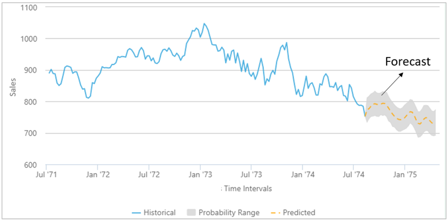
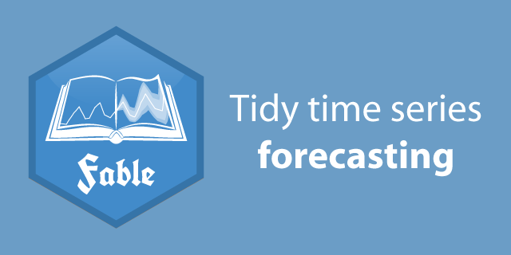
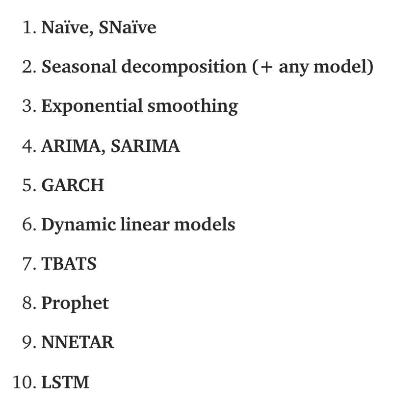

```{r setup, include=FALSE}
knitr::opts_chunk$set(echo = TRUE, fig.align = 'center')
library(tidyverse)
```


# Learning Objectives

  * Know what time series forecasting is 
  * Be able to create a simple forecast in R
  * Be able to check the accuracy of your forecast

# What is forecasting 

Time series forecasting involves creating and using a model to predict future values, based on previously observed values. 

<br>
<center>

</center>
<br>


# When do we use forecasting? 

Forecasting is required in many situations! Here are a few examples:  

1. Deciding whether to open another retail shop location - this requires forecasts of future demand, based on past retail demand in that location.   

2. Inventory planning requires forecasts of stock requirements  

3. Councils planning gritting resources for winter require weather forecasts for the next few weeks.    

Some of these things will be easier to forecast than others. For example, it is undoubtedly easier to forecast the air temperature tomorrow than the volume of sales a business might have over the next two years! 

# How do we create a forecast
 
To create a forecast, you have to use data you already have collected, and follow the normal data process we've learned about by now:

<br>
<center>

</center>
<br>

You then train models which take in and try to fit past data, and then you use your 'best' model(s) to calculate future predictions. It sounds simple enough, but the difficulty of any forecasting task depends on several factors, including:     

* **How much data is available**: the more data you have, the better your forecast will be  
* **How well you understand the factors that contributing to the forecast**: e.g. do you understand the seasonal variation in your data? Are there trends that need to be taken into account?  
* **Can the act of making the forecast actually affect what you are trying to forecast?**: this is a classic problem in much of the financial sector. 

Let's take an example. Say we are trying to forecast how much energy an offshore wind farm needs to generate to power a given set of homes. Generating a forecast of energy demand is usually relatively easy and accurate because we have a good understanding of the three conditions above:

* Unless it is a relatively new company with no access to the national grid data, you have a lot of data from previous years showing energy demand.    
* We have a reasonable understanding that when (for example) it's cold, people will turn on their heating and therefore energy demands will increase. We also know that domestic energy use increases over the weekend relative to weekdays, as residents tends to be at home then. 
* Making an energy demand forecast won't actually change the amount of energy homes require, so it's not a contributing factor. 

Now let's take another example of a situation that is hard to forecast: the stock exchange. Stock exchange data is notoriously difficult to forecast, as usually only one of the conditions above is satisfied:

* There is a lot of data available showing stock prices.   
* While we have some understanding of what influences stock prices, it changes rapidly from day to day, and depends in a complex way on many other variables we may lack knowledge of.  
* Making a reliable forecast of stock prices (if such a forecast was possible) would likely influence the same prices. For example, if traders saw a particular stock was forecast to do well, they might invest in it and this would in turn decrease the accuracy of the forecast.   

<br>

Forecasting models do not assume that processes never change, rather they assume that **the ways in which processes change** remain constant in time (e.g. the rate of change, the seasonal effects), and use this knowledge to step predictions forward into the future   

Whatever the difficulties, building effective forecasting models is a valuable skill of importance to a wide range of organisations, so it's worth practicing!  

<br>
<blockquote class='task'>
**Task - 5 mins** 

Take a few minutes and try to think of data that you may have encountered in your past job (or a job you'd like to work in) that it may have been of benefit to try and forecast. 

* What would you like to forecast? 
* What kind of data would you need?

</blockquote>
<br>

# Forecasting in `R` with `fable`

<br>
<center>

```{r, echo=FALSE, out.width = '60%'}

``` 

</center>
<br>

As usual, the `tidyverse` contains a package which allows you to do time series forecasting. 

<br>
<blockquote class="task">
The `fable` package bridges the gap between popular tidy data analysis workflows and time series forecasting. Using tidy temporal data from Earo Wang’s `tsibble` package, `fable` allows complex forecasting tasks to be performed with ease. It has been designed to provide the tools you need to forecast and model your time series data within the `tidyverse`.

Here are some of the main features of `fable`:

* It is designed for `tsibble` objects  
* It can handle many time series at once  
* It can fit multiple models at once  
* It produces point forecasts and distribution forecasts, and you can get prediction intervals and plots all in one package  
* It works in combination with the `tsibble`, `tsibbledata` and `feasts` packages, providing a smooth workflow

</blockquote>
<br>

Let's load all of these packages now:

```{r, warning = FALSE, message=FALSE}
library(tidyverse)
library(fable)
library(tsibble)
library(tsibbledata)
```

Let's say as an example we want to forecast Australian beer sales over the next few years, based on the past data we have. We'll use the `aus_production` dataset from the `tsibbledata` package. 

```{r}
# check the data
head(aus_production)

# check the names of our variables
names(aus_production)

# select the variables we need
beer <- aus_production %>%
  select(Quarter, Beer)

# use autoplot() to check the series
beer %>% 
  autoplot(Beer)
```

Great, now we have our data, and we know what it looks like, we can start fitting our model. 


## Defining and fitting a model 


Before fitting a model to the data, we first must decide the type of model we want to try! There are many different time series models capable of providing forecasts; the field is very rich and mature. Unfortunately, we won't have time this morning to go into much detail. Here are some of the typical models tried by forecasters:

<br>
<center>

</center>
<br>

Going through all these models is beyond our scope, but you can find out more about different models [here](https://towardsdatascience.com/an-overview-of-time-series-forecasting-models-a2fa7a358fcb)  

Specifying an appropriate model for the data is essential for producing appropriate forecasts. For this data set, a reasonable benchmark forecast method is:

 1. **Seasonal Naive model**, where forecasts are set to be equal to the last observed value from the same quarter. This looks more complicated than it really is. For example, given monthly data, the forecast for all future February values is equal to the last observed February value. Given quarterly data, the forecast of all future Q2 values is equal to the last observed Q2 value (where Q2 means the second quarter). Similar rules apply for other months and quarters, and for other seasonal periods. The **naive model** is pretty much the same (i.e. all forecasts are set to be the value of the last observation), apart from it works on non-quarterly data.   
 
 2. **Averaging model**: the forecasts of all future values are equal to the average (or “mean”) of the historical data.  
 
 3. **ARIMA model**: this stands for 'Auto Regressive Integrated Moving Average'. In reality, ARIMA refers to a class of models that 'explain' a given time series based on its own past values (that is, using so-called **'lags'** and lagged forecast errors). An ARIMA model with a seasonal component is called **SARIMA**, and is also a widely applied method. 
 
All these can be included in a single call to the `model()` function like this.

[To use the `fable::ARIMA()` function, you may need to install the `urca` package (this installs tests and helper functions for time series models)]

```{r}
# create a fit dataset which has the results from our three different models for beer production in australia
fit <- beer %>%
  model(
    snaive = SNAIVE(Beer),
    mean_model = MEAN(Beer),
    arima = ARIMA(Beer)
  )
fit
```
The returned object is called a `mable` or model table, where each cell corresponds to a fitted model. Because we have fitted models to just one time series, this `mable` has just one row. Note that the `fable` `ARIMA()` function tries to automatically fit a seasonal model by default!

## Calculating a forecast   

Neat! With some appropriate models specified, it is time to produce the forecasts. 

To forecast all models, we pass the object to the `forecast()` function in `fabletools`. The easiest way to use this function is by specifying the number of future observations to forecast, this is called the forecast **horizon**, hence the argument name `h`. So for example, we are setting the horizon here to the next `h = 12` observations, corresponding in this case to quarters. So our forecast will look 3 years into the future! 

```{r}
forecast_1 <- fit %>%
  fabletools::forecast(h = 12)
forecast_1
```
<br>

The return object is a `fable` or 'forecast table' with the following characteristics:

* The `.model` column becomes an additional `key`  
* The `.distribution` column contains the estimated probability distribution of the response variable in future time periods    
* The `Beer` column contains the point forecasts equal to the mean of the probability distribution.

We can also set the horizon using more natural periods: e.g. `h = "2 years"` can be used to predict two years into the future. For example:

```{r}
forecast_2years <- fit %>%
  fabletools::forecast(h = "2 years")
forecast_2years 
```
The `forecast()` function is able to interpret many different time specifications. For quarterly data, `h = "3 years"` is equivalent to setting `h = 12`.

<br>

## Plotting our forecast   

Once we've calculated our forecast, the easiest way to see how it performs is to visualise it. The `autoplot()` function will produce a plot of all forecasts. 

```{r}
forecast_1 %>%
  autoplot(beer) +
  ggtitle("Forecasts for Australian beer sales") +
  xlab("Year") +
  guides(colour = guide_legend(title = "Forecast"))
```

By default, argument `level = c(80,95)` is passed to `autoplot()`, and so $80\%$ and $95\%$ **prediction intervals** are shown. This is what those large shaded bar areas are. 

<br>
<blockquote class='task'>
**Task - 5 mins**

Let's try extending your forecast horizon further into the future, say to 10 years, and we'll use just the ARIMA model. Create a new forecast object like so:

```{r}
forecast_arima_10years <- fit %>%
  select(arima) %>%
  fabletools::forecast(h = "10 years")
```

Try plotting this forecast. What happens to the prediction intervals as time increases? Does this make sense to you?

<details>
<summary>**Solution**</summary>

```{r}
forecast_arima_10years %>%
  autoplot(beer) +
  ggtitle("SARIMA forecast for Australian beer sales") +
  xlab("Year")
```
The prediction intervals continuously increase in width. This means we become less and less certain of the forecast as time progresses away from the edge of the known data, which makes sense.
</details>
</blockquote>
<br>

If you want to avoid clutter, you can pass `level=NULL` into `forecast()` to turn off prediction intervals.

```{r}
forecast_1 %>%
  autoplot(beer, level = NULL) +
  ggtitle("Forecasts for Australian beer sales") +
  xlab("Year") +
  guides(colour = guide_legend(title = "Forecast"))
```

Great, now we have our forecast plotted and it's a little bit easier to see what is going on here. Sometimes you might just want to see past a certain year in the plot - that can sometimes make it clearer. 

```{r}
library(lubridate)

# create a shorter interval to plot: years after 1980
beer_shorter <- beer %>%
  filter(year(Quarter) >= 1980)

# plot the shorter one
forecast_1 %>%
  autoplot(beer_shorter, level = NULL) +
  ggtitle("Forecasts for Australian beer sales") +
  xlab("Year") +
  guides(colour = guide_legend(title = "Forecast"))
```

Or perhaps you want to view one model at a time, after the forecast object has been created. You can do this by filtering on `.model`:

```{r}
# view one model at a time
forecast_1 %>%
  filter(.model == "snaive") %>%
  autoplot(beer_shorter, level = NULL) +
  ggtitle("Seasonal naive forecast for Australian beer sales") +
  xlab("Year") 
```

## Comparing model accuracy

So far, we've calculated a few different models, but how do we choose the best of them? 

Well, for a start, we could just look at the forecasts in the earlier plot! It's pretty clear that the mean model doesn't fit the data at all well, as the forecast is just a straight line! However with the other two models, it's harder to tell. This is where more formal statistical tests of model accuracy come in. 

We are going to discuss this concept more fully in module 3, but when training models, it is now common practice to separate the available data into two portions: **training** and **test** data

* The training data is used to 'train' the models, i.e. find the model parameters that lead to predicted outcome variable values in closest agreement with actual observations
* The testing data is used to compare the models performance. None of the models have 'seen' the test data, and so it should provide a rigorous test of their performance.

The size of the test data is typically set at $20\%$ of the total sample, although this value depends on the sample size and the required forecast horizon (the test set should ideally be at least as large as the forecast horizon). Keep the following points firmly in mind: 

* A model which fits the training data well will not necessarily forecast well  
* A perfect fit can always be obtained by using a model with a large enough number parameters (this is called **overfitting**, again we will return to this in module 3)  
* Overfitting a model to data can be just as bad as failing to identify systematic patterns in the data.  

To compare the forecast accuracy of these models, we will create a training data set containing a subset of the data. We will then forecast the remaining years in the data set and compare the results with the actual observed values for those years. 


```{r}
# check our available years so we know where to put the split in the data
beer_years <- beer %>%
  mutate(year = year(Quarter)) %>%
  distinct(year)%>%
  arrange(desc(year))

beer_years
```

```{r}
# Now set our training data from 1992 to 2006
train <- beer %>%
  filter_index("1992 Q1" ~ "2006 Q4")

# run the model on the training set 
fit_train <- train %>%
  model(
    mean_model = MEAN(Beer),
    arima = ARIMA(Beer),
    snaive = SNAIVE(Beer)
  )
```

<br>

Now let's generate a forecast for 14 quarters (3.5 years), from  our training set data, and then plot it against the actual values.


```{r}
# forecast from the training set
forecast_test <- fit_train %>% 
  fabletools::forecast(h = 14)

# Plot forecasts against actual values
forecast_test %>%
  autoplot(train, level = NULL) +
    autolayer(filter_index(aus_production, "2007 Q1" ~ .), color = "black") +
    ggtitle("Forecasts for quarterly beer production") +
    xlab("Year") + ylab("Megalitres") +
    guides(colour=guide_legend(title="Forecast"))
```
Looking at it, it seems the seasonal naïve and ARIMA forecasts are fairly close to the observed values from 2007 onwards. The mean model doesn't look anywhere near it, so that model can be discarded at this stage.  
<br>

Now to check the accuracy, we use the `accuracy()` function. By default it computes several point forecasting accuracy measures such as:

* MAE (mean absolute error)
* RMSE (root mean square error)
* MAPE (mean absolute percentage error)
* MASE (mean absolute scaled error) 

for every key combination. You can find out more about each type of error [here](https://otexts.com/fpp3/accuracy.html)


```{r}
accuracy_model <- fabletools::accuracy(forecast_test, beer)

accuracy_model %>% 
  select(-.type) %>%
  arrange(RMSE)
```

In this case, the ARIMA model performs best over all accuracy measures. Sometimes, different accuracy measures will suggest differing forecast models as optimal, and then some finer judgment is needed. In this case, all of the results point to the ARIMA method as optimal, and so of the three models tried, we would use this one for forecasting. 


# Recap 

* What three things does a good forecast depend on?
<details>
<summary>**Answer**</summary>
How much data is available, how well you understand the factors that contribute to the forecast, and if the forecast can actually influence what you are trying to forecast. 
</details>
<br>

* What method of forecasting would you use to build a forecast where all values are set to be the value of the last observation?
<details>
<summary>**Answer**</summary>
Naive method
</summary>
</details>
<br>

* What can you do to test model accuracy?
<details>
<summary>**Answer**</summary>
Split your sample into training and testing sets, and compare the model predictions to actual values from the data. 
</summary>
</details>
<br>

# More Resources

[What is time series forecasting](https://machinelearningmastery.com/time-series-forecasting/)  

[Introducing fable](https://www.mitchelloharawild.com/blog/fable/)

[Suprising facts about time series forecasting](https://towardsdatascience.com/3-facts-about-time-series-forecasting-that-surprise-experienced-machine-learning-practitioners-69c18ee89387)  

[An Introductory Study on Time Series Modelling and Forecasting](https://arxiv.org/pdf/1302.6613.pdf)   


