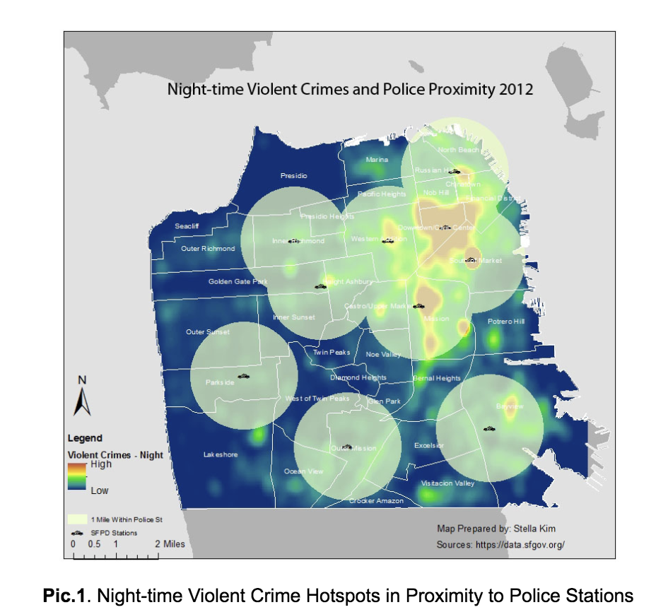
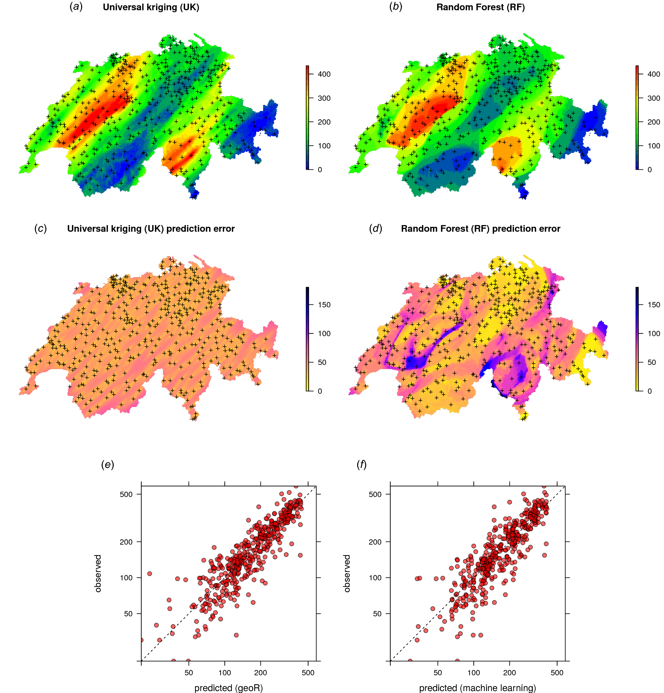
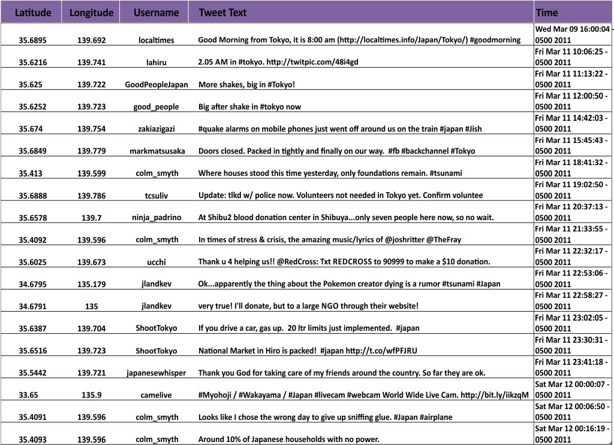
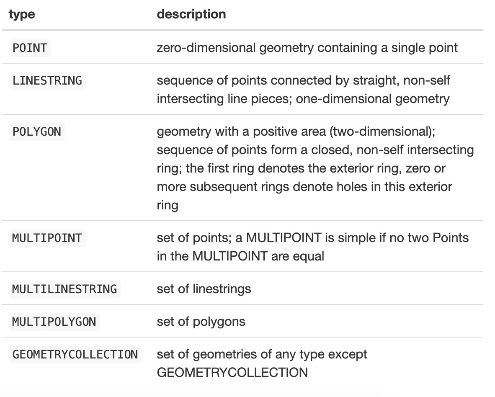

```{r setup, include=FALSE}
knitr::opts_chunk$set(echo = TRUE, fig.align = "center")
```


# Learning Objectives

* Know what spatial data is and how it is represented in R
* Know how to plot basic spatial vectors 
* Know how to create maps with `ggplot`
* Understand how to make interactive spatial maps with `leaflet`


# What is spatial data?

Spatial data refers to data about geographical locations, that is, places on earth. So to be more precise, we should speak about “geospatial” data, but we use the shorthand “spatial”.  

Spatial data comes in many different forms:

<br>
```{r, echo=FALSE, out.width = '80%'}

``` 
<br>

For example, you can have map data with data overlaid in layers on top, as in the plot above. 
<br>  
<br>  

```{r, echo=FALSE, out.width = '90%'}

``` 
<br>

Or you can have a mix: statistical test data plotted in heatmaps on top of grids, and corresponding points in scatterplots.   

<br>
<br>

```{r, echo=FALSE, out.width = '90%'}

``` 

<br>

Or you can have tabular data, with latitude and longitudes stored. We have already seen such data before. For example, if we look at our `airports` data from the `nycflights13` package (which we used yesterday), you will see it contains latitude (`lat`) and longitude (`lon`) variables. 

```{r, warning = FALSE, message = FALSE}
library(tidyverse)
library(nycflights13)
```

```{r}
airports %>%
  dplyr::select(name,lat,lon)
```


If we were to build models which tried to predict airport traffic, this would naturally have to include latitiude and longitude in some way. This would be a type of spatial analysis. Creating spatial models are beyond the scope of today, but we will learn how to manage, do basic calculations, and visualise spatial data in R.   


# How are spatial data represented?  

<br>

Spatial data are different than most numerical data we work with: while spatial coordinates are often encoded as numbers, these numbers have special meaning, and our ability to understand the data will suffer if we don't assign meaning to the numbers. 

As such, spatial objects are usually represented by vector data, rather than simply rows and columns. 

Vector data is best described as graphical representations of the real world. There are three main types of vector data: **points**, **lines**, and **polygons**. Connecting points create lines, and connecting lines that create an enclosed area create polygons. In all cases, the geometry of these data structures consists of sets of coordinate pairs (x, y).

<br>
<br>
<center>

```{r, echo=FALSE, out.width = '60%'}
knitr::include_graphics("images/spatial_data_types.png")
``` 


<br>
<br>
```{r, echo=FALSE, out.width = '70%'}
knitr::include_graphics("images/vector_types.png")
``` 

</center>
<br>


# Working with spatial data in R  

<br>
Spatial data are stored in special data structures (not just data frames or tibbles). The most common form is a **shapefile**. Shapefiles contain points, lines and polygons, along with vector-based instructions for drawing the boundaries between spatial objects (e.g. between countries, towns, cities on a map). As a result, working with shape files in R can be a bit more challenging than working with normal data frames and tibbles, but they allow you to have rich datasets with geographic content.   
<br>


## Simple spatial features (`sf`)


`sf` stands for **simple features**, a standardized way to encode spatial vector data. It is a formal standard that specifies a storage and access model of spatial geometries (point, line, polygon). 

So, what is a feature? A feature can be thought of as an object. In the real world, an object can be anything: a building, a tree, a cup. And while we think of these as "things" or "objects", in reality they are made up of different things. A tree is made up of trunk, branches, leaves for example. A feature is the same idea: it may be **one thing**, but it can be made up of many different parts, along side attributes that describe it. 

In terms of simple features, the standard says:  

>“A simple feature is defined by the OpenGIS Abstract specification to have both spatial and non-spatial attributes. Spatial attributes are geometry valued, and simple features are based on 2D geometry with linear interpolation between vertices.” 

This standard has been adopted widely, not only by spatial databases such as PostGIS, but also more recent standards such as GeoJSON. The following seven simple features are the most common:

<br>
<center>
```{r, echo=FALSE, out.width = '70%'}

``` 

</center>
<br>


In `sf` spatial objects are stored as a simple data frame with a special column that contains the information for the geometry coordinates. That special column is a list with the same length as the number of rows in the data frame. Each of the individual list elements then can be of any length needed to hold the coordinates that correspond to an individual feature. To work with `sf` objects, there is the `sf` package. 

Let's look at an example now. We have data within the `sf` package called `nc.shp`. As this is already a simple features object, we can use the `st_read` function allows you to read simple features files into R. All functions and methods in sf that operate on spatial data are prefixed by `st_`, which refers to **spatial and temporal**. 

This data is on sudden infant deaths in North Carolina for 1974-78 and 1979-84, and more information on this dataset and it's variables can be found [here](https://rdrr.io/rforge/spdep/man/nc.sids.html)

<br>

```{r, warning = FALSE, message = FALSE}
library(sf)
```

```{r}
# read in data about north_carolina using the st_read function
north_carolina <- st_read(system.file("shape/nc.shp", package = "sf"))
```

The short report printed gives the file name, the driver (ESRI Shapefile), mentions that there are 100 features (records, represented as rows) and 14 fields (attributes, represented as columns). 

*You can add, `quiet = TRUE` as an argument to this call if you don't want the simple features pacakge outputting information about the reading in process in the console*. 

If you print out the `north_carolina` dataset, you'll see the spatial data. It will be a bit different than what you are used to, but hopefully still readable. Let's check now.  

```{r}
# check class and look at the data
class(north_carolina)
view(north_carolina)
```


Attributes are typically stored in `data.frame` objects. As a result, feature geometries are also stored in a `data.frame` column. You'll notice though that when you `view` the data, the geometries are put in a list-column, with each list element holding the simple feature geometry of that feature. This is because geometries are not single-valued. 

You can have a look at the first three rows and see the features and the geometry.   

```{r}
# print out the north_carolina data
head(north_carolina,3)
```

<br>
In the output we can see: 

1. **simple features object (sf)**: a single record/row. This would be variables such as `AREA`, `PERIMETER`, `CNTY_`, all the way to `NWBIR79`.  

2. **simple feature geometry list-column (sfc)** : this is your `geometry` column.   

3. **simple feature geometry (sfg)** : this is the values within your `geometry` column (the coordinates)  

<br>

You can look at the attributes of an `sf` object by doing the following:

```{r}
# let's look at the attributes in the sf_column
attr(north_carolina, "sf_column")
```

The `attr()` function is a Base R function returns one specific attribute of a data object. Above we have specified that the attribute is the simple features column. Can also use it to give you the dimesions (`attr(north_carolina, "dim")`) and the column names (`attr(north_carolina, "names")`). You can read more about the `attr()` function in it's helpfile. 

<br>

You can access the geometry aspect of your spatial data using the following call:

```{r}
north_carolina_geometry <- st_geometry(north_carolina)
north_carolina_geometry
```
<br>
Geometries are printed in abbreviated form to save space. But you can view them by selecting them:

```{r}
north_carolina_geometry[[1]]
```

This highlights what we were saying before: spatial data isn't just stored as rows and columns. Instead, it is stored as lists of points, lines and polygon (or set of polygons). Understanding the relationship between these is key for spatial data exploration. The easiest way to see them is to plot them.  
<br>


### Plotting geometries 

The geometries can be quite hard to wrap your head round conceptually, so the best way to see it is to plot them. 
For visualisation, the `sf` package extends the base plot command, so it can be used on `sf` objects. If used without any arguments it will plot all the attributes.

If you want to plot all variables, you can do the following:

```{r}
plot(north_carolina)
```

<br> 

This can be quite difficult to see what is being plotted. Instead, it is easier to plot just a variable at a time to have a look:

```{r}
# plot the first column
plot(north_carolina[1])
```

<br>
This is starting to look better. Now we can see which counties within north carolina have larger areas, not only in terms of the shape, but also the colour (here, representing total area of the county). 


If you just want to plot one specific county (rather than the whole region), you can subset further:

```{r}
# subset the county 
plot(north_carolina[1,1])
```

Here we can see the geometry objects a bit easier: they will correspond to all the points representing lines, points, and objects. In this case, it's the shape of the counties within north carolina.

<blockquote class='task'>
**Task - 5 mins** 

Have a look through some of the variables within your `north_carolina` dataset, and see if you can create a spatial plot using the techniques above. 

</blockquote>


While the plot function is good, and relatively quick and easy to use, it has limits to its functionality. For more plotting options, we can turn to `ggplot`. 

<br>

## Spatial visualisation in `ggplot`  

<br>

`ggplot` has add in options for working with spatial data. In our case, we can use the `geom_sf` option (which is for plotting spatial **simple features** objects). Let's continue with our first simple example of our `north_carolina` data. For this, we can do a simple plot in the same way we might plot regular data:


```{r}
# plot the data using ggplot 
ggplot(data = north_carolina, aes(fill = SID74)) + 
  geom_sf() +
  theme_bw()
```

<blockquote class='task'>
**Task : 5 mins**

Try your hand at plotting another feature from the `north_carolina` dataset. What does it tell you?

<details>
<summary>**Answers**</summary>
```{r}
ggplot(data = north_carolina, aes(fill = BIR74)) + 
  geom_sf() +
  theme_bw()
```

This tells us that the birth rate is higher in certain counties compared to others. And this matches up with the number of sudden infant deaths (somewhat unsurprisingly).

</details>
</blockquote>
<br>


For simple spatial visualisations, ggplot does a lot of the heavy lifting, which makes it quite good to work with. Now let's work with a slightly more complicated example. For this example, we need to load the following packages:

```{r, warning = FALSE, message = FALSE}
library(rnaturalearth)
library(rnaturalearthdata)
library(rgeos)
```

<br>

The `rnaturalearth` package allows you to import the boundaries of countries (with different administrative levels) from around the world. The data comes from the platform naturalearthdata.com. [I recommend exploring the package on the github page here](https://github.com/ropensci/rnaturalearth).  

Next, we can load in our world spatial data and return it as a **simple features** object. For this, we use the `ne_countries` function from the `rnaturalearth` package, which simply returns the country boundaries from the package, at your specified scale (in our case, medium) and type (again, we want a simple features object):

```{r}
world <- ne_countries(scale = "medium", returnclass = "sf")
class(world)
view(world)
head(world, 1)
```
<br>


Now we have our data, we can plot it with `ggplot`, just like we would other data. 

```{r}
ggplot(data = world) +
    geom_sf() +
    xlab("Longitude") + ylab("Latitude") +
    ggtitle("World map")
```

Nice! Now we can also add colour, as you would with "normal" data objects:

```{r}
ggplot(data = world) +
    geom_sf(color = "black", fill = "lightgreen") +
    xlab("Longitude") + ylab("Latitude") +
    ggtitle("World map")
```

That is our basic world map. 

But what if we want to start doing some descriptive analysis on it? i.e. just looking at total values or variables for a start?

Well we can do this as we would in our normal data process. For example, if we want to plot the estimated population by country, we can add this into our plotting function:

```{r}
ggplot(data = world) +
    geom_sf(aes(fill = pop_est)) +
    scale_fill_viridis_c(option = "plasma", trans = "sqrt")
```

In this example, we use the “viridis” colorblind-friendly palette for the color gradient (with option = "plasma" for the plasma colour variant), using the square root of the population (which is stored in the variable `POP_EST` of the world object).

Also note that a transformation to the `pop_est` variable when plotting the colours. Square root transformations can be used to stabalising large numbers but emphasising the differences between smaller numbers (in this case without the transformation the large figures for India and China dominate being able to see differences between other countries). 
<br>


<blockquote class='task'>
**Task - 5 mins**

Recap your knowledge from ggplot week, and set your `geom_sf` aesthetic to be filled with the estimated gdp (`gdp_md_est` variable). Extra points if you make your map colour blind friendly!

What does your plot tell you? What does it tell you compared to the population?

<details>
<summary>**Answer**</summary>
```{r}
head(world)

ggplot(data = world) +
    geom_sf(aes(fill = gdp_md_est)) +
    xlab("Longitude") + ylab("Latitude") +
    ggtitle("World map") + 
  scale_fill_viridis_c(option = "plasma", trans = "sqrt")

```


This tells us that despite not having the highest population, the US has the highest estimated GDP. China is closely following...  

</details>
</blockquote>
<br>

Great, now we've done our first basic spatial visualisations in `ggplot`.  

<br>


## Subsetting simple features

What if we only care about one particular country? We can subset the data as we would in tidyverse:

```{r}
# filter the data based on country
country_italy <- world %>%
  filter(name == "Italy")

# check the dimensions to make sure we only have one
dim(country_italy)

# make a plot
ggplot(country_italy) + 
  geom_sf() + 
  ggtitle(country_italy$name) + 
    xlab("Longitude") + ylab("Latitude")
```

And volia! We have a subset of our spatial data.


## Calculating distances between features 

Spatial operations differ substantially from attribute operations on data frames: the type of spatial relationship between objects must be considered. All spatial objects are related through space and distance. 

The distance between two objects is calculated with the `st_distance` function (again, from the `sf` package).  

Depending on how your data is structured, there are different ways to prepare your data to calculate distances.   

For our `world` data, our distances are in degrees. But for the calculation of distances it is more convenient to use meters instead of degrees. You can read more about the conversion between degrees and meters for Earth measurements [here](https://sciencing.com/convert-distances-degrees-meters-7858322.html)

To convert our distances of degrees into meters, the first thing we do is to transform the map of our country of choice (in this case, Italy) to UTM. 

UTM stands for Universal Transverse Mercator. UTM is a system for assigning coordinates to locations on the surface of the Earth. It works by dividing the earth into 60 zones and projects each to the plane as a basis for its coordinates. You can read more about UTM [here](https://gisgeography.com/utm-universal-transverse-mercator-projection/) which has a nice orange peel metaphor to describe how it works.  

To convert to UTM we can use the function `st_transform` which takes in the data, and something called an EPSG code. Every geographic object (coordinate system, spheroid, unit etc.) gets assigned a unique EPSG number. For our country, Italy, I just googled **Italy EPSG code**, and it returned **3003**. And so you can just google the code you are looking for. 


```{r}
#transform to UTM
country_transformed <- st_transform(country_italy, 3003)
```

<br>
Next we can create a custom grid to plot our data. For this, we can use the function `st_make_grid`. This allows you to create grid overlapping on our region of interest. In our case, we will put our transformed data in, with a resolution of 50km (cellsize = 50000 - metres in our case). The resolution was found through trial and error of different sizes. And we include the call `what = ` to show what geometry we would like to create what (polygons, centers or corners).

```{r}
#create the fishnet
grid <- st_make_grid(country_transformed, cellsize = 50000, what = "centers")

plot(grid)
```

<br>

Nice, now we have a little grid of points. So we can continue to calculate the distances. 

To estimate the distance we use the `st_distance()` function that returns a vector of distances for all our points in the fishnet. But first it is necessary to transform the map from a polygon shape `(MULTIPOLYGON)` to a line `(MULTILINESTRING)`. 

Why do we need to do this? Well, if we want to calculate distances between two points, we need to have them as lines instead of shapes. So if we convert to a line, we are able to measure distances from one point to another. For this example, we want to measure the distance between each point and the nearest point in the country outline (the coast). 


We do this with the function `st_cast`.

```{r}
#transform from polygon shape to line
country_line <- st_cast(country_transformed,"MULTILINESTRING")

#calculation of the distance between the coast and our points
dist <- st_distance(country_line,grid)

#distance with unit in meters
head(dist)
```

This tells us, for each point in our map (`grid`) the distance between it and the nearest coast (the `country_line`). 

<br>
Once we have our distances, we can plot this as well:

```{r}

#create a data.frame with the distance and the coordinates of the points
distance_plot <- data.frame(dist=as.vector(dist)/1000,
                    st_coordinates(grid))

head(distance_plot,5)

```

Here, we have made a data frame to combine our distance and grid data. The object `dist` is a matrix of one column, so we have to convert it to a vector with the function `as.vector( )`. In addition, we divide by 1000 to convert the distance in meters to km. The `st_coordinates()` function extracts the coordinates of our points. 

Finally, we can plot a heatmap to show distance of our country.   
<br>

```{r}

ggplot(distance_plot) +
  aes(X,Y,fill=dist) + 
  geom_tile() +
  scale_fill_gradientn(colours = topo.colors(50)) + #colors for plotting the distance
  labs(fill="Distance (km)") + #legend name
  theme_void() + #map theme
  theme(legend.position = "bottom") 

```


And there we go! We have calculated distances of spatial data and plotted it in R. 

<blockquote class='task'>
**Task - 15 mins** 

Pick a country of your choice, and following the code above, make a distance plot. Make sure you write down your interpretations of each plot as you go. 

</blockquote>
<br>

## More features of mapping

### Zooming in on particular areas 

<br>
Now we know started looking at some values of data plotted in a spatial way. We can then start to be more complex in our mapping. For example, the extent of the map can also be set in `coord_sf` so it can be more or less zoomed in on your area of interest. 
*Note that the limits are automatically expanded by a fraction to ensure that data and axes don’t overlap; it can also be turned off to exactly match the limits provided with `expand = FALSE`*

Here, let's plot the Gulf of Mexico:


```{r}
ggplot(data = world) +
    geom_sf() +
    coord_sf(xlim = c(-102.15, -74.12), ylim = c(7.65, 33.97), expand = FALSE)

```

And we can fill it with variables from the data yet again: 

```{r}
ggplot(data = world) +
    geom_sf(aes(fill = pop_est)) +
    coord_sf(xlim = c(-102.15, -74.12), ylim = c(7.65, 33.97), expand = FALSE)


```

<blockquote class='task'>
**Task - 5 mins**

Have a play around with your coordinate systems, and try to plot a different region of the world. *Hint: read the help documentation for `coord_sf`. 

</blockquote>

### Adding labelling

Now we've managed to zoom in on a particular region of interest, we can add information on top of our spatial layers. Convienently, the world data set already contains country names and the coordinates of the centroid of each country (among more information). We can use this information to plot country names. 

This can be a somewhat complicated process: first we need to figure out where the centre of each polygon (shape on the map) is, get the coordinates of those, and then add them into our dataset so we can use them to plot.

You may get a warning message *'st_centroid does not give correct centroids for longitude/latitude data'* - that's because centroids are computed assuming flat, 2D space but longitutude/latitude data this is 3D. This is not an issue for us as the exact precision is not too important here but if you were calculating distances you may need to transform you projected geographic system (like we did to transform from lat/long to UTM).

<br>
```{r, warning=FALSE}
# use the st_centrold function to get all the centre points of each geometry (each shape)
world_centres <- st_centroid(world$geometry)

# get the coordinates of each of these 
world_coordinates <- st_coordinates(world_centres)

# add them into our dataset 
world_points <- cbind(world,world_coordinates)
```
<br>

Once we've done this, we can plot our data. You may remember from `ggplot` week that you can add text using `geom_text`.  

<br>
```{r}
# plot these, along side our zoomed in 
ggplot(data = world) +
geom_sf(fill ="grey") +
geom_text(data= world_points,aes(x=X, y=Y, label=name), color = "darkblue", fontface = "bold", check_overlap = TRUE) +
coord_sf(xlim = c(-102.15, -74.12), ylim = c(7.65, 33.97), expand = FALSE)
```

Ace! This is looking more informative now. We can also manually add information as a layer if we want using the `annotate` function. Here, we are adding a label to note the Gulf of Mexico.  

```{r}

# the annotate function can be used to add a single character string at a specific location, as demonstrated here to add the Gulf of Mexico. 
ggplot(data = world) +
geom_sf(fill ="grey") +
geom_text(data= world_points,aes(x=X, y=Y, label=name), color = "darkblue", fontface = "bold", check_overlap = TRUE) +
annotate(geom = "text", x = -90, y = 26, label = "Gulf of Mexico", fontface = "italic", color = "grey22", size = 6) +
coord_sf(xlim = c(-102.15, -74.12), ylim = c(7.65, 33.97), expand = FALSE)

```


<blockquote class='task'>
**Task - 10 mins**

Have a play around with the plot above, and see what changing parameters does, what using different variables does, what else you can plot, etc. 

</blockquote>


# Spatial analysis with `leaflet`

Now we've made some static plots with values overlaid, we can finish up with an extension: interactive plots. You first encountered `leaflet` in the ggplot week. As a reminder, `Leaflet` is one of the most popular open-source JavaScript libraries for interactive maps. It’s used by websites ranging from The New York Times and The Washington Post to GitHub and Flickr, as well as GIS specialists like OpenStreetMap, Mapbox, and CartoDB. You can use the `leaflet` package for R to overlay your data on top of interactive maps. You can think about it like Google maps with your data overlaid on top!

A leaflet map widget is created with the `leaflet()` command. This is the first layer of your plot. We will subsequently add layers to this widget. 

The first layer that we will add is a tile layer containing all of the static map information, which by default comes from OpenStreetMap. This is denoted by the `addTiles()` line of code. 

The second layer is a marker, which designates a point location. 

Let's look here at the birthplace of R (New Zealand!)  

```{r}
library(leaflet)

r_birthplace_map <- leaflet() %>%
  addTiles() %>%  # use the default base map which is OpenStreetMap tiles
  addMarkers(lng=174.768, lat=-36.852,
             popup="The birthplace of R")
r_birthplace_map
```

And voila! We've plotted our first spatial map in leaflet. 

<blockquote class='task'>
**Task - 5 mins** 

Can you use the cran package documentation to change the marker points on the leaflet plot above?

</blockquote>  


Now we can try to do something a bit more complex: take spatial data from the web, turn it into a useable format in R, and create a leaflet map. 

The data we will use is a **JSON** format file (coming back to haunt us from data types week!). It holds information about current surface water in the state of Colorado, USA. These are good for spatial data, as they use list type input and store non standard data. [You can look at the data here](https://data.colorado.gov/Water/DWR-Current-Surface-Water-Conditions-Map-Statewide/j5pc-4t32)  

To get this data, we use the function `getURL`. 

```{r, library = FALSE, message = FALSE}
library(RCurl)
library(jsonlite)
library(tidyverse)
library(leaflet)
```


```{r}
# now we combine our url with the attributes we want to take (only active stations, and those in Boulder, Colarado)
colarado_data_url <- paste0("https://data.colorado.gov/resource/j5pc-4t32.json?","&county=BOULDER")

# now we actually load the data in.
water_data <- getURL(URLencode(colarado_data_url))
view(water_data)
```

<br>
We have our data in, but as is our past experience it's a pain to work with it in this format. So let's remove the nested data frame. 


```{r}
# remove the nested data frame
water_data_df <- fromJSON(water_data) %>%
  jsonlite::flatten(recursive = TRUE) 
```

Now we want to clean our data, and finally plot it:

```{r}
# turn columns to numeric and remove NA values
water_data_df_clean <- water_data_df %>%
  mutate_at(vars(amount, location.latitude, location.longitude), as.numeric) %>%
  filter(!is.na(location.latitude))

# create leaflet map
leaflet(water_data_df_clean) %>%
  addTiles() %>%
  addCircleMarkers(lng = ~location.longitude,
                   lat = ~location.latitude)
```


<blockquote class='task'>
**Task - 5 mins** 

Look around the water plot above. What does it tell us about the surface water in Boulder, Colorado?

</blockquote>  

## Additional options in `leaflet`

There are lots of additional options you can change in both the `addMarkers` and `addCircleMarkers` functions. You can see these in their help files and also there are some helpful pages online (including https://rstudio.github.io/leaflet/markers.html, which also gives information on other plotting options) 

We will mention two handy options below: 

### Radius in addCircleMarkers
You can add another dimension to the circle markers, by making the size of each marker the value of a variable, by using the argument `radius` in the `addCircleMarkers` function. 

You may find you need to transform the radius, by dividing or multplying all the values so that the scale is appropriate for your graph. In the example below the we will use the amount of surface water to be represented by the size of the circle markers (and will transform the sizing by dividing by 100, this value was found by trial and error). You can also adjust the `weight` argument to make the circles more or less transparent in colour. 

```{r}
leaflet(water_data_df_clean) %>%
  addTiles() %>%
  addCircleMarkers(lng = ~location.longitude,
                   lat = ~location.latitude, radius = ~ amount/100, weight = 1)
```

### Clustering 
We can also see what the `addMarkers` function looks like when there is many points. 

```{r}
leaflet(water_data_df_clean) %>%
  addTiles() %>%  
  addMarkers(lng = ~location.longitude,
                   lat = ~location.latitude)
```

There is also an option to use the `clusterOptions` argument to group makers together, and the clusters will have a colour scale depending on how many markers are in the group. The clustering adjusts as the users zooms in and out of the map.  

```{r}
leaflet(water_data_df_clean) %>%
  addTiles() %>%  
  addMarkers(lng = ~location.longitude,
                   lat = ~location.latitude,
             clusterOptions = markerClusterOptions())
```

We can also use the clustering option for `addCircleMarkers`. 

```{r}
leaflet(water_data_df_clean) %>%
  addTiles() %>%
  addCircleMarkers(lng = ~location.longitude,
                   lat = ~location.latitude,  
                   clusterOptions = markerClusterOptions())

```


# Recap 

* How is spatial data represented?
<details>
<summary>**Answer**</summary>
Points, lines and polygons
</details>

* What is the standard for spatial features in R?
<details>
<summary>**Answer**</summary>
Most are represented in shape files, and can be loaded in as **simple features** (which is a combo of points, lines and polygons)
</details>

* What is the benefit of using leaflet over using a static mapping representation?
<details>
<summary>**Answer**</summary>
Sometimes it’s necessary to zoom in or pan around a map for greater comprehension while exploring data spatially.
</details>


# Additional resources

[What is spatial data analysis](https://www.sciencedirect.com/topics/computer-science/spatial-data-analysis)  

[Spatial analysis in R](https://www.rspatial.org/)  

[Spatial analysis: an Introduction](http://www.spatialanalysisonline.com/An%20Introduction%20to%20Spatial%20Data%20Analysis%20in%20R.pdf)  

[Leaflet for R](https://rstudio.github.io/leaflet/)  

