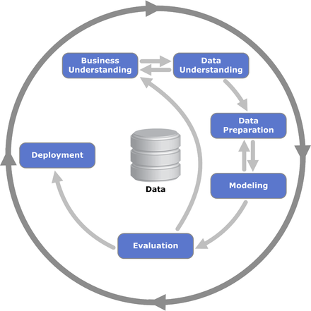

```{r setup, include=FALSE}
knitr::opts_chunk$set(echo = TRUE, fig.align = "center")
```

# Learning Objectives:

* Understand the attributes of a machine learning model
* Know the steps involved in developing a model
* Be familiar with model development terminology
* Identify suitable analytic techniques to solve specific problems
* Correctly calculate and define target variables
* Understand the importance of avoiding using future data leaks in predictions

**Lesson Duration: 30 mins**

This week we'll be taking our first steps into the world of **machine learning**, which will no doubt immediately conjure up images of AIs like HAL 9000, WALL-E and Deep Blue. There are many, many steps between us and Skynet though; first we need to learn how to develop our own machine learning models and apply them to some datasets.

# Some Terminology

We'll hear a lot of new terminology this week. We'll explain everything important as we need it, but for now we'll give a general overview of some of the terms we'll need:

| Term                    | Definition                                                                                                                 |
|-------------------------|----------------------------------------------------------------------------------------------------------------------------|
| **Dataset**                 | What we're learning from                                                                                                   |
| **Model**                   | A representation of what we have learned from the data                                                                     |
| **Feature**               | An input used for prediction. For structured data likely to be a column, but will differ for unstructured data (e.g. images it may be edges or corners)                                                                                              |
| **Variable**               | An alternative name for a feature                                                                                           |
| **Data Preparation**        | The process of cleaning the dataset and deciding which features are important for us.                                      |
| **(Un)Supervised Learning** | Learning either according to set examples (supervised) or by looking for patterns and inferring connections (unsupervised) |
| **Validation**              | Evaluating the quality of a model                                                                                          |
| **Overfitting**             | When a model is too closely aligned to the data it was developed from and so it not good to be reused with a different dataset     |
| **Prediction**             | The output of a model when it is applied to an unseen dataset                                                              |
| **Attributes**              | The properties of a data point, eg. a person's height, age, hair colour, etc                                               |

# What is Machine Learning?

The first question on everyone's lips is surely **what is machine learning?** Depending on who you ask you will get different answers, but Arthur Samuel's description from 1959 is a good starting point: **"[The] field of study that gives computers the ability to learn without being explicitly programmed". Many will involve **artificial intelligence (AI)** in some context. Some feel that ML is an important part of what constitutes AI -- that it's one of the tools used to simulate intelligence; others argue that it is an implementation of AI -- that we use the AI to learn from data. It is important to note that it is not the _only_ part of AI though: there are many cognitive and creative processes which must work in tandem with machine learning before we can even reach the 70s sci-fi stage of AI.

```{r, echo=FALSE, fig.cap="Marvin the Paranoid Android - the most depressed of all 70s AIs", out.width = '50%'}

```

Although machine learning comes in many different flavours, the various algorithms have the same goal: **to learn about some user-defined parameters based on a dataset provided to them**. The main thing that is often prioritised is **accuracy**, as ultimately we will use the insights we have gained from the algorithm to inform future decisions. However, **understanding and explainability** of what the model is doing is also hugely important (if we think back to our ethics lesson) and in some cases there can be a trade off between accuracy and understanding. 

It is also important to remember that we still regard an algorithm failing to learn anything as a succesful result: if there's nothing there to be learned, we don't want it to return us a false positive.

Machine learning often goes hand-in-hand with **data mining**. 

## Data mining

Data mining is the process of identifying patterns in large existing datasets in order to facilitate machine learning. 

It goes on all around us every day, often without us even realising it's happening. Every time you buy something on Amazon or watch a film on Netflix you create another data point for them which is fed into their machine learning model. That data contributes to the decision about which products to recommend to you when you next sign in. They won't always get it right, but every data point they get helps to improve the end result.

# Developing a Model

Machine learning algorithms come in many shapes and sizes. Most algorithms can be applied to most situations, but as with many things in life there's usually going to be a best tool for the job. Which tool that is will be determined by many things, for example the dataset(s) available to us or the computing resources we have access to. The most important factor, though, is the question we should always ask ourselves when we start work on a model: _what is it that we're trying to learn?_

That is in itself a multi-part question. First we need to consider the dataset we have available and if it's sufficient for our needs. Our model can only ever be as good as the data we give it, and if we try to crowbar a model onto a dataset which it doesn't fit then our results will be practically worthless. We also need to think about how we want our results to look, as a dataset sufficient for one algorithm may not work for another. Consider the example of Amazon from earlier: let's say they want to learn about people who browsed a certain product. A dataset good enough for learning if they bought it or not will likely not be good enough for learning anything more granular (size, colour, etc).

When we have identified what we want to learn we refer to it as our **target variable**. This is the variable that represents our model's output and therefore what we are trying to predict. The target variable can be either binary or continuous, depending on the algorithm used. Correctly identifying target variables is critical to a model's success.

<blockquote class="task">
**Task - 10 mins**

1. Consider a dataset where the variables represent students' marks over the course of their degree: marks expressed as a decimal (eg, 75.39) for each module taken plus an overall average calculated from them. If we are predicting their final grade, which will be the target variable?

<details>
<summary>**Answer**</summary>
The overall average
</details>

2. A phone company is trying to predict how many users will exceed the limits in their contract each month (text messages, total call length and total data usage). If they have variables indicating the number of calls made, the number of text messages sent and the number of emails received, which would be most suitable as the target variable?

<details>
<summary>**Answer**</summary>
The number of text messages. The others do not contain any information about the length of the calls or volume of data, which are what the limits are expressed in terms of.
</details>

3. A shop bases the number of staff it has working on any given day on the number of face-to-face sales completed. Which would be most appropriate to use as a target variable: online orders, phone orders, total sales, in-store sales or total enquiries?

<details>
<summary>**Answer**</summary>
In-store sales. All will contribute to how busy the store is, but the problem is framed in terms of a specific request and only in-store sales reflects that.
</details>

</blockquote>

## CRISP-DM

There is a standardised methodology for developing machine learning models, known as the CRoss Industry Standard Process for Data Mining (or CRISP-DM). Developed in the mid-90s, it provides a platform-agnostic framework for data scientists working on data mining problems.

```{r, echo=FALSE, fig.cap="The CRISP-DM process diagram", out.width = '50%'}

```

There are six steps to CRISP-DM:

1. **Business Understanding:** Identifying the requirements of the business and translating them into a well-defined machine learning problem.

2. **Data Understanding:** Familiarisation with the data. At this point we may look for interesting subsets or do some preliminary experiments. The exact size and shape of the dataset we need will be guided by the machine learning algorithm we're using, which will itself be determined by our end goal.

3. **Data Preparation:** The different machine learning algorithms each have their own requirements in terms of how the data looks before we apply them. Some of the tools covered in week 3 still apply here, and R has packages available which will help. We'll look at data preparation in more detail later today. Part of this will be identifying our **predictor variables**, which will be used as the basis for determining the value of the target variable. There must be at least one predictor variable in a model.

4. **Modelling:** We select our machine learning algorithm, depending on what we're trying to predict. Again going back to our example, if we simply want the answer to a yes/no question ("did the customer buy the thing?") we can use a _binary classification_ algorithm. On the other hand, if we want more granularity ("when customers bought the thing, what colour did they pick?") we may want to look at _clustering_.

5. **Evaluation:** Assessing the effetiveness of our model when it is applied to an unseen dataset. At this point we want to ensure that the _fit_ of our model is correct (more on this later in the week) and that our model addresses the problem identified earlier.

6. **Deployment:** The model is released into the wild, where it will be applied to new data as it arises and used to inform future business decisions.

Some of these terms may be unfamiliar, particularly the different types of models, but we'll talk about them in more depth later in the week. The important thing to know for know that the two mentioned above are only two of **many** different types of machine learning algorithms. Some have been around for years already and will still be here for years to come (regression, decision trees); some lack mainstream popularity but excel at what they do in their own niche; some experience a surge in popularity which may not be sustainable in the long term.

Each of these algorithms has its pros and cons. It may be obvious which one is the best fit for a given scenario, but not always. Judging which algorithm to use is a skill which will come with experience, as will perhaps the knowledge to develop new algorithms. Over the next 2 weeks we'll look at four of the most common algorithms, which will give you some examples of the different scenarions in which similar algorithms could be applied.


# Recap

* What does the target variable represent in a model?
<details>
<summary>**Answer**</summary>
The thing we are trying to predict
</details>
* What are predictor variables used for?
<details>
<summary>**Answer**</summary>
Calculating the value of the target variable
</details>

# Additional Resources

* [Machine Learning Glossary](https://developers.google.com/machine-learning/glossary/)
* [Examples of ML algorithms](https://towardsdatascience.com/types-of-machine-learning-algorithms-you-should-know-953a08248861)
* [What is Data Mining?](https://searchsqlserver.techtarget.com/definition/data-mining)