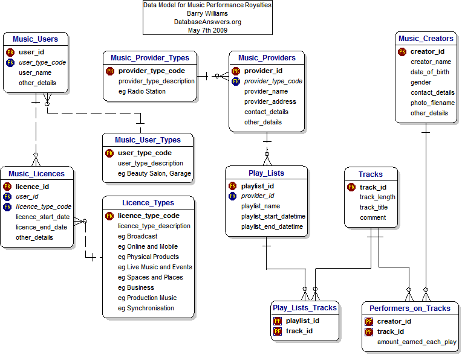
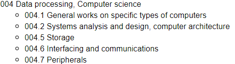

```{r setup, include=FALSE}
knitr::opts_chunk$set(echo = TRUE)
```

# Learning Objectives

* Gain a high level appreciation of what a data model is
* Understand the context of the emergence of data models
* Understand the benefits of data modelling

### Duration - 40 minutes

# What is a Data Model?

The definition of a data model is pretty dry!

Before we get down to definitions let's consider a real life example where it is very likely a data model underpins something we all use every day.

Think about a typical data streaming app e.g. Spotify

Search for a song title in the search bar.

If you look at the results you are swamped with all sorts of information relating to that song title:

* Individual recordings
* Album recordings
* Playlist inclusions
* Podcast episodes....

And then if you select one of the individual recordings you can get to information about the track itself:

* Performed by
* Written by
* Produced by

You can bet all that information wasn't just thrown into a database to be presented on an app front end.

The likelihood is that the app's development involved a typical lifecycle of 

* Requirements definition
* Analysis
* Design
* Build
* Test 
* Implementation 

And in the world of our Music App development a large part of the analysis and design will have focussed on understanding the data of not only the pieces of music themselves, but how we might want to access these bits of music in the brand new age of the app!  That understanding will have resulted in a data model to inform a robust database design behind it..

<details>
<summary>**Maybe along the lines of this one**</summary>



Credit: Barry Williams http://www.databaseanswers.org/data_models/music_performance_royalties/index.htm
</details>

Similarly, the tables you were dealing with on your SQL module took some thinking through, designing and implementation.  That first stage of coming up with the animals, diets, keepers and care_schedule tables is some consideration of what the data content is that you are dealing with and how it relates to each other ...i.e data modelling.

So at its most basic definition - a data model brings order to chaos through providing a map of an information landscape.  

In our example above, the primary information artefact is the piece of music but it is embedded in a complex world of albums, artists, playlists, etc.  

Behind all that someone has taken the time to map it out into an understandable structure.  That map is a data model and its function within the app is to provide a clear foundation for the building of the physical application.

Looking at more definitions:

### Wikipedia Definition

> "A data model is an abstract model that organizes elements of data and standardizes how they relate to one another and to properties of the real world entities."

### Technopedia Definition

> "A data model refers to the logical inter-relationships and data flow between different data elements involved in the information world."

Feel free in your own time to do some more searching around for definitions to get a feel for data models.

# Origins of Data Models?

If you think about it, explaining the information landscape is nothing new - it goes a very long way back.

As soon as humans started to see the benefits of understanding the universe around them, they started to organise information.  After all, information is the basis of all knowledge and learning.

Libraries are the obvious examples of management of information through structuring the content and they have been around for a long, long time.


The Ancient Library of Alexandria in Egypt is a famous example where the thirst for knowledge in the ancient world led to cataloguing and classification of books and papers to support a great research facility - the Mouseion...the first ever museum!  And before that there was a history of libraries in Greece and other parts of the near east.

So a library was probably the first place where people consciously came up with systems to order books and therefore access the information inside them.

As library users you'll no doubt be aware of the 2 main mechanisms to manage the books:

1. Catalogue of the books
  * Author
  * Title
  * Publisher
  * Publication date
  * ISBN
  
2. Subject area classification for non fiction books.  There are a number of classification systems in use, the most famous in the UK is probably the Dewey Decimal System.  

<blockquote class = 'task'>

**Task - Library Classification Systems - 5 minutes**
 
Just for a bit of fun, individually do an online search for the Dewey Decimal System.

Have a quick read on its history and broad structure then identify which number in the Dewey Decimal System collects together books on **Data Processing**

<details>
<summary>**Answer**</summary>

Under the 000 Generalities & computer science class:



</details>

</blockquote>

The DDC is an example of a Taxonomy where layers of classification are used to organise information and the benefit of the numbering system is that it provides a location pointer to a particular set of shelves collecting books on the same topic together in one place.

We'll come back to taxonomies later on but for now its enough to see the parallels between taxonomies and data models - they both facilitate access to information through structuring in a predefined way.

## So what moved us beyond taxonomies?

Why in the late 1950s/early 1960s did we suddenly need more than a catalogue and taxonomy to access information?

The answer is that data models go hand in hand with computers!

The emergence of computers and capability for information management and data processing led to data models.

Prior to computers and data processing we accessed information through organising what was contained in an artefact you could get your hands on, e.g. book in a library. Cataloguing and classifying books, documents and real world things was the way to mapping our information world.

As soon as you could hold information in machine readable format you had the potential for chaos.  That chaos needed straightened out into an understandable map ...hence the Data Model

Check out some good summaries of the history here:

* [Wikipedia](https://en.wikipedia.org/wiki/Data_model) 
* [DataVersity](https://www.dataversity.net/brief-history-data-modeling/) 
 
# The Value of Data Models Today

## Data in the Organisation

Everyone here will already appreciate what data means to today's organisation!

But here is a quick refresher anyway:

* capture and analysis of business data helps an organisation make decisions for the benefit of the business going forward
* capture and analysis of operational data helps improve business processes and efficiency
* well managed operational data supports effective customer and supplier interactions 

The organisation has at its fingertips a plethora of technology choices available which will support these functions.  

However it is the data which is the key component and the technology can't function on its own without good system design.

Before an organisation can ever successfully implement data based solutions it must first understand:

* what data is coming into, or is already held within the organisation
* what the requirements (including legal obligations) for storage of the data is
* how and when it wants to use the data to support the business
* who is interested in the data, who is the data about

**So...In order to manage, collect and analyse data, an organisation must first map and understand its data**

## Enter the Data Model!

<blockquote class = 'task'>

**Task - Benefits of data modelling - 10 minutes**

Do an online search for something along the lines of "how can data models help"

Find what you think are the 3 top benefits of data models in an organisation.

Class discussion

<details>
<summary>**Discussion points - Summary of benefits**</summary>

Data modelling is the first data architecture discipline employed when representing business data requirements in a structured way.

Data models provide:

* Unambiguous documentation of business data concepts and therefore the means to communicate these concepts consistently within the organisation
* Precision on how data concepts relate to one another - business rules such as a Customer can only open 1 Account, but that Account may be held by more than 1 Customer
* Mechanism to scope and define a new data development - develop solutions working from your enterprise level model down into detailed design (termed as top down analysis/data modelling)
* A way to document the content and workings of an exisiting system and incorporate that into your enterprise "big picture" (often termed as bottom up analysis/data modelling)
* And possibly most important for communication - a way to graphically represent data in a diagram and walk through the concepts with a visual aid

* [Another useful DataVersity article](https://www.dataversity.net/data-models-many-benefits-10/) 

</details>

</blockquote>

So you are now getting the gyst of why data professionals advocate data models.

### What happens if you don't have a Data Model?

We've covered the benefits of having a data model.  Some examples of what happens if you don't have one, or you have lost one that used to exist.

<div class='emphasis'>

A database was designed 20 years ago.  A new regulatory requirement comes along and a solution needs to be found quickly.  A developer is tasked with finding somewhere in the database to put the new data.  All he has is the table structures, the original data model was lost years ago so no documentation.  So what happens?

* he picks a field that has a name that might fit the new requirement
* he builds the code to add the data into the field
* super - job done, data is being captured
* result?  The database now has 2 sets of data in the same field with nothing distinguishing the fact they have different meaning.  Even worse, a subset of the values are regulatory and the regulator needs evidence the data is being gathered.

A proper requirements analysis would have identified a suitable home (preferably through use of the existing data model), modelled it and designed the solution thinking of all the possible requirements to extract that data later on.

</div>
<br>
<div class='emphasis'>

The CEO decides she would like to understand how many customers have taken out an insurance policy for their cat in the last year compared with previous years.  There is no report which currently does this.  The analyst tasked with locating the right data for this has no idea where to start.  He has to get the database design, dig through it to find the right tables and fields.  He can't find anything relating to the type of pet.  Is that data held anywhere, or has it never been captured.  Many hours are spent trying to find this information out. Meanwhile the CEO is thinking how difficult can it be to get me this information! <br>
A data model of the system would have been a single go to place to determine the data stored about an Insurance Policy application.

</div>  
<br>
<div class='emphasis'>

Two organisations have decided to join forces and become a single market leading company.  Both have Customer databases that they want to merge into one but neither databases have a data model supporting the definition of the data.  Instead they have to dissect the contents of the tables to check where data can be merged or replaced.  Many hours are spent documenting the contents again.

</div>

<br>

## Selling Data Modelling as something the Organisation should do

The concept of data models and why an organisation might find them beneficial is notoriously hard to explain to the key stakeholders in an organisation.

It was mentioned at the course introduction that whilst data models were appreciated as a key part of the systems development process 20 years ago, there has gradually been a decline in resources dedicated to data modelling.  This has been due to a number of factors including:

1. Data Modelling is expensive - it takes time and time is money.  
2. The benefits of a data models for good quality data design are hidden from the guys with the cash.
3. The emergence of package solutions where an organisation can just pick up something off the shelf and plug their data in apparently negates the need for a data model...  in reality you still need to understand what data it is you are plugging in make sure it goes into the right place... so a model is still desirable
4. The vicious circle of lack of money for modelling leads to loss of focus on the skillset so good Data Modellers are a dying breed (literally...we are all ancient!)

But courses like this are changing that - the new appreciation of Data as a key resource is bringing about a change.

Hopefully at the end of this module you will be convinced of their benefits but to end this introductory session here's a background task for you to consider in your own time:

<blockquote class = 'task'>

**Task - Background task - Introducing Data Models to your Manager**

Something to do over the course of the next 2 days.  Imagine you are in a newly formed data team in a small organisation.

The team has been set up because the CEO has an idea that he/she needs to be taking more control of the company's data but doesn't really know where to start.

You have an understanding of data models and believe this is where the team should start.

Begin making preparatory notes for a meeting you plan to have with the CEO on why you think this is a good idea, and why the team should be allowed to make this part of the investment.

Over the course of the next 2 days continue to make a list of what you would say in this situation.

</blockquote>


# Recap

* A data model provides a map of an information landscape, "bringing order to chaos"
* In order to aid understanding models usually take a graphical form with different graphical constructs representing different things
* Data Modelling was recognised as a means to documenting systems in the new world of computing and data processing
* Different types of models perform different functions, we'll be focussing on the Relational Data Model
* Data is a massively important asset to an organisation, understanding that data and documenting in data models gives the organisation a valuable tool for development of strategies and systems


# Additional Resources

* [Check out Google](https://www.google.com) 
* [And we've mentioned DataVersity](https://www.dataversity.net/category/data-topics/)
* The best book on Data Modelling...Steve Hoberman: Data Modeling Made Simple; 2nd Edition


