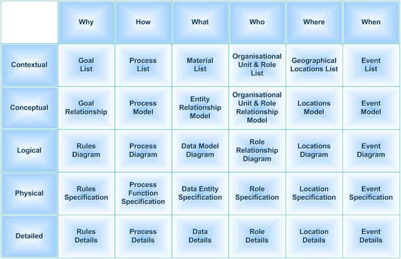

```{r setup, include=FALSE}
knitr::opts_chunk$set(echo = TRUE)
```

# Learning Objectives

* Understanding Data Modelling within Data Architecture
* Getting to grips with layers and scopes of data models
* What needs to be in place before starting modelling - some tips on Standards and Tooling
* Suggested tools for downloading

### Duration - 45 minutes

# Data Models in the Context of the Wider Architecture of an Organisation

Before we get cracking on the How of Data Modelling, just a few more things to cover on the real world context of data models within an organisation.

We've looked at the importance and usefulness of data models in order to describe the data requirements of an organisation.

However, if you think about the functioning of an organisation as a whole, data doesn't sit in isolation.

Data interacts with pretty much everthing else in the organisation:

* People
* Processes
* Systems

The full definition of the interactions of these things is an *Enterprise Architecture*. So depending on the size, maturity or just experience of those working within the organisation, you may find yourself looking at data modelling within the structure of a pretty well defined Enterprise Architecture... or your modelling might be feeding into a brand new world of Enterprise Architecture... or not!

Data Modelling as a discipline is big enough to stand on its own, but in a medium to large organisation it can add more benefit if it is positioned within a fully defined architecture covering all the other elements which enable the organisation to function correctly.

We're not going to go into any details about Enterprise Architecture frameworks or methodologies.  However it is worth just illustrating what we are referring to:


The Data layer within the overall enterprise architecture can itself be termed an Enterprise Data Architecture (EDA).  Data Architecture is the full documentation of how data as an information asset interacts with systems, processes, people and becomes a blueprint for aligning data development with business strategy.


In your own time have a look online for overviews of EDA and frameworks.  There is a lot of help out there if you want to look at data models in the wider context of Architecture.

<div class='emphasis'>
Before we leave Enterprise Architecture it is worth mentioning a favourite framework with a good focus on data - the **Zachman Framework**

[Check out the Zachman Website for more information](https://www.zachman.com) 

As a quick intro this picture illustrates the content of the framework (for the bona fide version you can download the current Zachman diagram from the Zachman website for personal use).


Credit: Ideasintegration(image) + SunSw0rd(text) - Own work, CC BY-SA 3.0, https://commons.wikimedia.org/w/index.php?curid=20113287

What the Zachman framework does is:

* takes all the things which make up an organisation - along the top
* breaks the architecture down into layers of detail - down the left
* in each cell suggests what architectural documentation should be captured for the organisation component and the layer of architecture

You will see that data features in the **What** column, i.e. the organisation is founded on what it captures and stores and passes around within processes.  So data...as we all know...is the centre of the universe!

</div>
<br>
<div class='emphasis'>
Also worth mentioning at this point the fact that the job title Data Architect and Data Modeller often get used interchangeably, mainly because the role of Data Modeller has been consigned to history in some organisations and everyone in IT seems to demand the title of *Architect* or *Engineer*!!

A **Data Modeller** creates and manages data models...

A **Data Architect** has a wider remit than that.  Whilst a Data Architect may, on occasions, need to create data models in order to document their Data Architecture, they have the additional task of documenting the interactions with that data from other organisational elements - people, processes and systems.

So if you see a job title of Data Architect double check the roles and responsibilities of the job, it may truly be a Data Architect role, or it may be focussed on data modelling.
</div>
<br>

# Layers of Models

What the Zachman Framework (or any other EDA overview) illustrates is that there are different layers of enterprise definition moving from a high level business view down to a very detailed technical implementation view.  The Data Models fit into the same layered approach.

Here is another diagram specific to data models outlining the layers and illustrating the fact that as you work down the layers the level of complexity gets greater and the scope expands. Similar to Zachman, the top layer is not a data model but is an enterprise top level set of information giving context to the business.


Credit:George McGeachie  https://metadatajunkie.wordpress.com/pyramid/

What do the different layers give us:

<blockquote class = 'task'>

**Task - Layers of Data Models - 10 minutes**

We have some clues from our diagrams but individually do an online search for definitions of data model layers and make some quick notes. (Ignore the Enterprise layer).

The information you should have come up with is described in the summaries below.

<details>
<summary>**Conceptual Data Model**</summary>

The Conceptual Data Model(CDM) is a high level representation of the business in terms of its key concepts.  A concept is something understood by the business to be of importance to its function.  Not necessarily a real world object (although it usually is), but something important enough to be captured and defined. Some of these concepts will be commonly understood across all businesses e.g. Customer, but some will be very specific to the particular business activities of the organisation.  The key output of the CDM is an agreed set of definitions of the business concepts, supplemented by an understanding of the relationships between them.

</details>

<details>
<summary>**Logical Data Model**</summary>

The Logical Data Model (LDM) represents the detailed business requirements for data in the organisation. It adds more detail to the CDM and is a prerequisite for building any data solutions but it remains solution agnostic.  The content captures data definitions which make sense to business stakeholders but at the same time holds enough detailed information to inform solution design. 

</details>

<details>
<summary>**Physical Data Model**</summary>

The Physical Data Model (PDM) is created to support a data solution implementation.  It should be based on the LDM but then is "tweaked" to make the solution performant for whatever environment (hardware and software) the data will be created/maintained/accessed on e.g. Oracle database, DB2 database, XSD messaging...etc.  

</details>


</blockquote>

# Data Model Scopes

So returning to the diagram above, the scopes broaden out as you go down the layers.

Thinking about the purposes of each layer think about their scopes...

## Conceptual Data Model

Because the CDM is aimed at the business stakeholders it works best if it covers the whole organisation....that is it is an Enterprise Conceptual Model (and by enterprise it doesn't need to be a massive organisation).  If the enterprise decides to organise its functions into domains, e.g. Payments Processing, Customer Management etc, then the CDM may be split to align with these.

Also important to note that it doesn't require a skilled modeller to come up with a conceptual model, just a good business analyst with an interest in data who can work with the business experts to draw out the key *concepts* (clue is in the name!) and come up with an agreed definition.

Whilst it is good to attack an enterprise CDM in a single exercise it is also possible to build it up gradually in line with pockets of development.  Or even extract it from some Logical modelling exercise (which itself may even have been initiated form some reverse engineered physical model).

Ultimately, however, the use of the conceptual model is to describe the key things of interest and importance to the business therefore an organisation should be aiming over time to arrive at that enterprise wide model.

It is important to note also that a conceptual model isn't a prerequisite to anything.  You choose whether or not it is going to add benefit to the business.  A small organisation may be happy enough with its understanding of the key things of interest to its business. The driver for modelling might be understanding data enough to inform systems developments and road maps in which case you can skip the conceptual model and go straight to logical modelling.

Within our modelling exercises we will make reference to how a CDM is structured.

## Logical Data Model

A LDM is a prerequisite to any data solution design.  The LDM documents requirements but at a logical, system agnostic level.  Therefore the start point to a logical model might be a fairly restricted scope of a proposed application.  Alternatively it may be that enough analysis might already have been done to produce something aligning with an enterprise conceptual mode covering the whole organisation.

Regardless of what has been modelled prior to a design project, any requirements must be confirmed against an existing model. New requirements for an application may enhance, or even change the current view of the data captured in an existing model.  

Data Models are a long term investment, they need to be maintained, kept right up to date in order to inform the next data development.  A data modeller in an organisation needs to appreciate that their modelling not only serves a purpose right now but is a legacy to support the organisation going forward! Always consider, will someone understand what I have documented in 5 or 10 years' time?

A Logical Data Model needs someone skilled in data modelling but with good analysis skills in order to drive out definitions, rules and how the business plans to use the data.

The LDM will be the main focus of our modelling exercises over the rest of the module.

## Physical Data Model

A PDM is an implementation model used to actually drive out an implementable data structure for data storage or manipulation. 

So a Physical model will tend to be 1:1 with a physical application or data store.  And there may be many physical models implementing one area of the logical model.  As we said before, the logical model is implementation agnostic, it describes business requirements for data and rules.  This only needs to be documented once but may be implemented many times in different solution types.

We'll come onto physical data models tomorrow but for now just to say that physical data modelling isn't just a case of logical modeller throwing the model over to a technical designer.  It is a hugely important process that involves the handover of requirements understanding from the modeller to the designer whether that be a DBA for a database design, or a UML service designer.  The logical model provides a "first cut physical design" and then the 2 modellers work together to optimise the solution model dependent on how the data will be accessed and used, and on what technology implementation.  So it is very much a joint effort and getting this process right is key to a smooth, cost effective development.  


# Preparing for Data Modelling

## Standards/Conventions

Tempting though it may be to launch straight in to creating data models, if your organisation is new to data modelling you should first take time to work out the standards and conventions you want to use for your model.

Simple things such as standardising on Capitalising entity names and all lower case for attribute names makes a big difference in being able to easily identify what is being documented.  If you have a number of modellers in the team you must all be consistent in how you are working.

So take time to put in place a set of standards for your modellers.  In the course of working through some tasks we'll come back to this and will make recommendations and reference to best practice.

## Tooling

A lot of data modelling can actually be done with a combination of spreadsheets for documenting the different components of the model and paper and pencil for illustrating the relationships between the concepts or entities.

However, things have moved on a bit since the days of the drawing template and there are many tools in the marketplace that support data modelling from conceptual through to physical design. 

We'll cover some of the desirable features when we get into modelling for real but ideally you want something that covers all modelling layers. Being able to retain traceability of your requirements modelling from the CDM through to the PDM is desirable.  Aand forward engineering of a PDM through to creation of a database schema is essential if you are implementing data structures.  Reverse engineering capabilities from database back to PDM and LDM is also very handy if you need to document a database retrospectively.  

Other things to look out for are diagram export and reporting capabilities.  It is extremely handy to be able to report out your model contents into something you can share with stakeholders such as a spreadsheet data dictionary, or an HTML view of the model which allows users to click through content without being familiar with the modelling tool.  

Tools also cover different methodologies and notations.  For example, for the bulk of this course we are following Entity Relationship (ER) modelling using the Information Engineering (IE) notation as that is the most commonly used, and arguably most readable.  But a quick google search of "Data Model Notation" will provide information on the most commonly used.  We will also be covering this when we start on the data modelling in the next section.

Unfortunately there are few good tools which cover the full modelling lifecycle - looking at the pyramid diagram again:


Most modelling tools focus on the bottom 2 layers.  The top 2 layers are better suited to UML tools which can document business architecture in general.  We'll talk a bit more about UML tomorrow but if you want more information on it just google it.  UML (Unified Modeling Language) has a very powerful suite of diagram types for describing the business and systems.

Unfortunately most good modelling tools supporting ER modelling cost money, options for Open Source are quite limited and are often just slimmed down versions of something you will need to pay for to get full functionality.  It's even harder to find ones which are available for the Mac.

If you are going into an organisation and are serious about ER modelling then have a good check around the internet for tooling and reviews.  Get trial versions and play with them.

Another tooling option is to go for something which covers UML modelling which we will be coming onto on day 3.  UML modelling tools can be adapted to support ER modelling but not the other way round.  UML is very powerful in architecture modelling so if you feel you might be going down that route for understanding the bigger picture of your organisation then a UML modelling tool may be the way to go.


<blockquote class = 'task'>

**Tooling options for this class**

Below is information on some tooling options for you to use within this module.  Take some time to have a look at the options. The recommendation is that you download **Navicat** for use in the modelling exercises. Take a few minutes to sort this out on your machines.

</blockquote>

<details>
<summary>**Tools**</summary>

**Diagramming Tools**

Diagramming tools tend to be more intuitive to use than modelling tools however they don't allow documentation beyond the 2 dimensions of a diagram.  They must be used in conjunction with a documentation tool such as spreadsheet.  However a couple of good tools are available with templates for ER modelling and UML modelling.

1. Visual Paradigm online 

https://online.visual-paradigm.com/solutions/free-visual-paradigm-online/

2. Draw.io

https://www.draw.io

The template under Software Diagrams titled Software/database_3 is the closest to an ER LDM diagram or just open a blank diagram and load the **Entity Relation** drawing shapes.

**Modelling Tools**

1. Navicat Data Modeler Essentials

Navicat is a fairly simple modelling tool which allows creation of Conceptual, Logical and Physical models and automatic conversion from one layer to the next (that said, the Physical model constructs are very rudimentary).

**This will be the tool used for the example files and is recommended for you to download for your own use.**

It is available free on the Mac App Store, or can be downloaded from here:

https://www.navicat.com/en/download/navicat-data-modeler-essentials


2. Open ModelSphere

Open ModelSphere is a useful open source tool which is mostly UML based but has been customised for ER Modelling:

http://www.modelsphere.com/org/open_modelsphere.html see the tips for installation

Some additional hints for Mac installation are included here:

http://www.marco-savard.com/OpenModelSphere/download/installationNotes-Macintosh.html


3. Eclipse Papyrus

If you are familiar with Eclipse there is also a good tool you can install and play around with:

https://www.eclipse.org/papyrus/download.html

-	You’ll find from there it ultimately takes you to an Eclipse installation manager or download and you need to get your java right for it. 

</details>

# Recap

* Whilst Data Modelling can be done as a standalone activity, it provides greater benefit when it is set in the context of a wider data and enterprise architecture
* Data models can operate in different layers, each giving a different perspective for a different audience
* Data modelling within the organisation needs preparatory work on standards and tools to ensure consistency and a long term investment in the outputs


