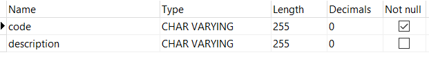
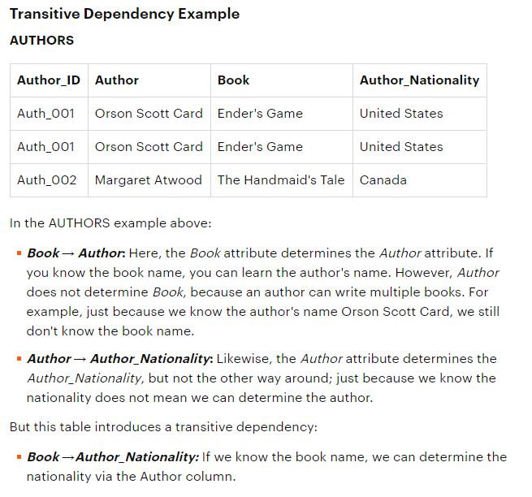
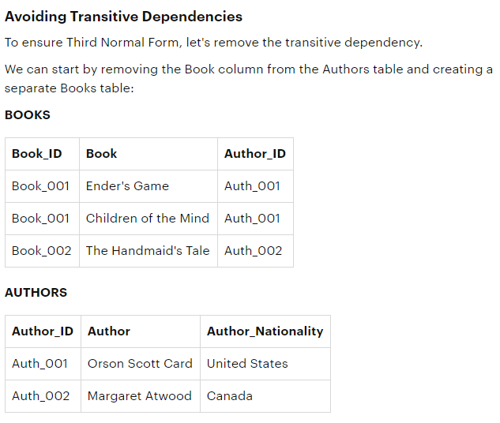
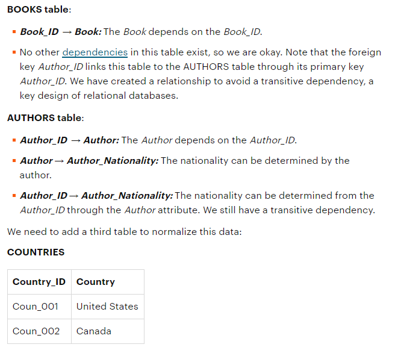
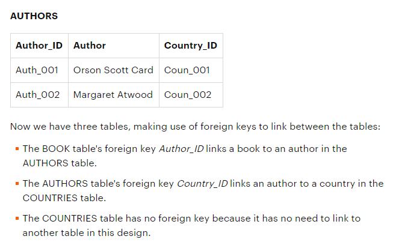
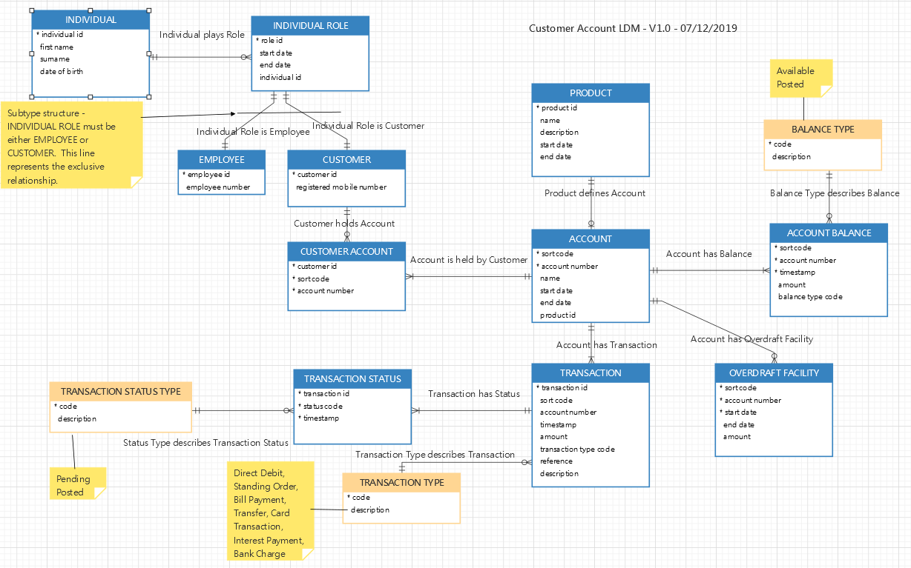

```{r setup, include=FALSE}
knitr::opts_chunk$set(echo = TRUE)
```

# Learning Objectives

* Understand the precursors to producing a LDM
* Understand the process of coming up with an LDM
* Overview of the different component parts of the LDM
* Gain awareness of things to look out for

### Duration - 1.5 hours

# Pre requisites to Logical Modelling

Apart from a tool and some standards, What do you need to hand before you can get started on the exercise of creating an LDM?

## Requirements Stage

Neither the model scope nor its content can be dreamt up out of thin air.  The modelling task has to start with **REQUIREMENTS**.

Talk to any modeller and they will tell you that chasing down requirements is the bane of their life.  

First of all the model has to have a well defined scope.

We've already covered the purposes of a logical model, and the fact that because it is essentially a definition of data requirements for the organisation, it can have any size of scope set by the project in hand.  Examples might be:

* An enterprise wide LDM to support the enterprise for use as a reference model to development teams - so they have no need to start from scratch with development requirements modelling.  This kind of exercise would typically be taken in an architectural area with a CDM as input.

* A LDM supporting a new development based on a restricted set of functionality e.g. the animal feeding schedule in the SQL course

* A LDM describing an existing system - arrived at through reverse engineering a database

Secondly, you need to understand how data is used within the organisation in order to set the rules around the data and its relationships.  If you are going forward into solution design this becomes critical.

You should either expect to receive some statement of scope and purpose in the form of requirements documentation from the customers of any developments.

Requirements might take the form of:

* User stories or use cases
* Business process models
* Front end screen shots
* List of data items in a document, report or spreadsheet

For reverse engineering or documenting an existing system:

* Content of an existing copybook
* DDL from an existing database plus, if you're lucky, a data dictionary

When modelling for a development you really want a combination of all of the above captured in a comprehensive Business Requirements Document (BRD)

### Who writes requirements?

Typically a Business Analyst is responsible for pulling together content for the modeller and will interact with the business experts on your behalf.  However, in a smaller organisation it may be your role to carry out the analysis for your own models. Analysis for IT projects is a skill very much overlooked.  On the face of it it sounds easy to ask some questions and get the answers into a document however thought needs to be put into asking the right questions and digging into the answers to get what you want.  Moreover, capturing that into useful documentation requires an understanding of how that documentation feeds into the modelling process.  For this reason, it is actually a bonus if you are responsible for gathering your own requirements.

Regardless of how you are getting the information you need, you will always require one or more Subject Matter Experts (SME) you can go to in order to ask questions and get useful answers.  Also consider things such as spending a few hours sitting with the people carrying out functions (e.g. booking office) to get a feel for how they capture and use data.

<div class='emphasis'>
If you want to look more into defining requirements have a look particularly at Use Cases.  
These are a very thorough way to document the interactions of systems on data.

* The Steve Hoberman book already referenced - Data Modeling Made Simple contains a simple overview.
* The recommended diagramming tool Visual Paradigm also has a great tutorial: https://www.visual-paradigm.com/tutorials/writingeffectiveusecase.jsp
* For more in depth guidance see the bible written by Alistair Cockburn: Writing Effect Use Cases
</div>

## What type of LDM?

Next thing to consider, what is the best type of LDM deliverable for the end purpose. The term LDM usually applies to Entity Relationship (ER) Modelling.  We are going to focus on that in our exercises as this is the model which lends itself to database developments and is a good format for capturing detailed rules around data attributes, types, business rules etc.  However, the general definition of a Logical Data Model is a system agnostic representation of business data and relationships, therefore other types of models might apply depending on the final outcome you want to achieve.  Class models or dimensional models might suit your needs better but we'll come onto those in a later session.

<div class='emphasis'>
A couple of things to reiterate:

Modelling is not an exact science, different modellers might have a different take on things - it doesn't necessarily mean one model is more right than another - as long as it works.

Modelling is an iterative process.  Although the steps below imply a logical sequence, in reality you loop around between entities, attributes and relationships many times until you reach your final model.

</div>

# Logical Modelling Steps


We will now work through an example in class before you go and do your own model as a Lab.  

As mentioned in the tooling overview you have a choice of what tooling to use at what stage.  Ultimately you need your model in a modelling tool but the means to get there can vary depending on preference.  If you are starting with a workshop of business experts always start with a whiteboard and sketch ideas out to start with.  And if you are sitting mulling things through yourself then paper, pencil and, most importantly, an eraser are the best tools you can use.  You would move onto the modelling tool when you have a fair degree of comfort in your structures.

So we'll do this on the whiteboard and a Navicat file will be supplied in your course content for reference.

OK we can get started. If you had a CDM providing a summarised view of the entities and relationships in your scope that would be your start point, but for the purposes of demonstrating the process, in this case we are creating a model from scratch from a description of requirements for a data solution.

<br>
<details>
<summary>**Modelling for the Value Bank Mobile Banking Datastore**</summary>
<blockquote class = 'task'>

 
The Value Bank has decided to move into the 21st Century and offer mobile banking services.  This requires the development of a new datastore which will ultimately take over from a legacy database which is to be decommissioned within 2 years and will be the master source for this data.  In the future it will be extended to cover the full operational data of the bank.

Phase 1 delivering this mobile banking capability wants to provide the following facilities to Individual Customers of their Current and Savings Accounts:

1. Log in through a secure portal.  
  + This login process and associated security detaila and access tokens are outwith the scope of the analysis as an off the shelf solution has been purchased from an external partner company.

2. On entry to the system the logged in Customer will see their personal details:
  + Name
  + Registered mobile phone number
  + If they are a member of staff they also get a different screen design and see their Employee Number

3.Customer will also see a list of active accounts which may be Savings or Current Accounts.  At this summary level they will see the following details:
  + Product Name i.e. Value Savings Account or Value Current Account
  + Sort Code and Account Number identifying the account
  + Name of the Account
  + Name of any joint account holder.  A joint account holder is another Customer attached to the Account.
  + Current available balance
  + For the Current Account only - the amount of any overdraft facility which is included in the available balance
  

4. On selecting an account the Customer will see a list of:
  a. any transactions pending today
  b. 10 most recent posted transactions 
  
5. Each transaction requires:
  + debit or credit indicator
  + total amount
  + timestamp of when it happened
  + type of transaction, i.e. Direct Debit, Standing Order, Bill Payment, Transfer, Card Transaction, Interest Payment, Bank Charge
  + payment reference

Statement and other historic data is currently out of scope.

The modelling task is to create a Logical Data Model as the first step of designing a database to support this requirement.

</blockquote>
</details>


## Step 1 - Identify Entities

In identifying the entities we are looking to identify the "things" the business deals with. The CDM follows the same approach but in that model they are called concepts and are restricted to only the key things of interest to the business.  In the LDM we call them entities as they are real life things the business captures information about and ultimately might want to design some kind of data solution around. So the level of detail is greater than that in the cDM but essentially we are looking for nouns in any business description, use case, process definition etc.

**Method:**

1. Look for anything in the description you think might be an entity
  + look for the nouns
  + look also for anything that refers to Type and add that in, e.g. Transaction Type
  + add these as new entities into the main diagram (don't worry about relationships right now)
  + if you have started thinking about relationships (see Step 3 below) and you have identified a many:many relationship you will need to add a **resolving entity** between the entities at each end of the relationship
  
2. Once you get your entities into the modelling tool make sure you define them.  In Navicat:
  + right click on the entity
  + select Design Entity
  + open the Comment tab at the right hand side and add your definition in there.

<details>
<summary>**Note on Defining Entities (and Attributes)**</summary>

One of the main purposes of the LDM (or CDM) is to agree a single definition of an entity or attribute that works for the organisation. You must define every element in your model and best to do it as soon as you identify it. Never think OK, I'll go back and do that later...you never find time to!

Definitions need to focus on WHAT the thing is, and potentially its purpose in the organisation as supplementary text. Lifecycle of the concept may also be included.  

Entities are named and described in singular terms.

Here is a sample definition for the concept of **Customer** within our Bank Account example

*A Customer is any party who has made contact with the Bank and who has been recorded for the purposes of communication.  This may be a party interested in, actively, or historically holding an ACCOUNT with the Bank.  It may also be a party who has requested an ad hoc communication, e.g. in the case of a general enquiry or compaint.*

Note the definition is singular and gives clarity (business rule) on the lifecycle of when an individual is considered to be a Customer.  It also provides business rules around the role of the Customer.  A useful convention is to start other entities included in the definition with capital letters to alert the audience there is a related concept defined elsewhere in the model.  Another tip is to just refer to your organisation as *the Bank* or *the organisation*.  Your models are for internal consumption and there is an implied boundary to the models which is the organisation itself.

<div class='emphasis'>
Arriving at a definition:

You are modelling things of interest to the business so definitions should be constructed through discussion with stakeholders and arriving at an agreeable definition involves the art of questioning!!  

* Questions should start fairly open ended and then drive more into the detail to nail it down such as: Can you give me some words describing What you understand a .... to be?
* Depending on what is said then try and play back a more succinct version and double check they still agree with that meaning
* Probe any possible ambiguities coming through e.g. "you said a Customer is someone who holds an account. What about if they just come in to a branch, provide some details, have a discussion and leave again to think about it - are they still a Customer?"
</div>
</details>
<br>
<details>
<summary>**Note on Types of Entities**</summary>

If we look at the entities you'll be seeing some different characteristics: 

There are 3 main categories of entities:

1. Strong or Independent entities e.g. Customer, Account - these entities can stand alone, are managed independently of anything else in the model and will own other entities.
2. Weak or Dependent entities, these are owned by the Independent entities and are dependent on the parent entity. If the parent is removed then this ceases to exist.  This applies to something like Transaction which must be owned by a Bank Account, plus all the resolving entities (we will cover these below under Relationships). 
3. Classification or Reference data e.g. Currency, Gender, Account Type - we are only interested in these in order to support our business.  Much of the reference data you can actually source from standard lists e.g. ISO Country Codes, ISO Currency Codes etc.  Its always worth googling for reference values as it saves effort on your part and also aligns you with any external data you might be interacting with.

</details>

## Step 2 - Identifying Attributes

OK so we have our entities sorted out, at least our first iteration of them.  The next step is to add the attributes.

Note: In the CDM we don't worry about attribute, concepts tend to be at the entity level unless there is a really key concept which is an attribute, e.g. Sort Code is ultimately an identifier of an organisation unit but it is so important we may want to include it in our CDM. 

<div class='emphasis'>
In adding the attributes we are doing detailed analysis and the upshot of this is often that you rework, or add new entities.  

And whilst we have Identifying Relationships as Step 3, in reality it is sometimes useful to work through some of the relationships at the same time.  

The process of arriving at your model can be quite fluid, don't worry what order you do things in, you tend to find your own way that works.
</div>


An attribute is an individual data item describing it's parent entity e.g. Customer Date Of Birth.  Attributes are sometimes referred to as *Data Items*, *Data Elements*, *Fields*.  Best to pick your term and be consistent - the most correct for an LDM is Attribute.

Entities describe instances of real life things e.g. Individual is an Entity definition of the instance that is you, or I.  An attribute describes a data value - e.g. in a spreadsheet the column header is an attribute and the cells contain the values. 

Similar to entities, one of the main purposes of the LDM is to define every attribute to enable a consistent understanding within your organisation.  So as well as a textual definition of WHAT the attribute is, we have additional properties to define, contextual to it's parent Entity.
<br>
<details>
<summary>**Data Types and Domains**</summary>

An attribute in the LDM describes an instance of a data value and all data values take the form of a data type e.g. Character, Numeric, Decimal, Date, Time etc.  A data type must be assigned to the attributes.  Sometimes it is enough just to assign the out of the box standard data types which usually come with the modelling tool.  When forward engineered into a physical model these will be translated into the valid types specified for the target database e.g. DB2.

However, sometimes you may want to specify some restriction on a base type to enforce a business rule.  E.g. you may want to say that name text should be restricted to 30 characters.  Or that bank account number must be 8 numeric.  You can either restrict the values for a specific attribute or if this is something you want to define globally so that you can reuse it then you should define a data domain.  Unfortunately Navicat doesn't facilitate the creation of a data domain library but you get the idea.

Lists of enumerated values are also sometimes referred to as data domains, i.e. allowed value of what something can be.  

We have our Reference entites such as Gender.  The way we are defining the allowed values is just to include it in the definition of the code value attribute.  
</details>
<br>
<details>
<summary>**Cardinalities and Optionalities**</summary>

*Cardinality* refers to the multiplicity of an attribute i.e. 1 or many.  

Within an ER model and attribute is not allowed to repeat within and entity (see the Normalisation section below) so cardinality is always 1 for attributes.

And *Optionality* refers to whether something is optional or mandatory as an attribute. For attributes we are looking at the context within the entity *as used in the Organisation*. For example, in the real world, a person always has a date of birth.  But in your organisation although you might be storing data about a person of interest to you, you may or may not have their date of birth.  So in your model the optionality of your Date Of Birth attribute is 0..1, indicating that is is an optional attribute and it has a maximum cardinality of 1.  On the other hand you may decide that Surname is mandatory and give it a cardinality of 1, i.e. mandatory and maximum of 1.


<div class='emphasis'>
Navicat tip:

Different tools capture this in different ways but in Navicat there is a tick box for Not null.  If this is checked then the attribute is mandatory.



</div>
</details>
<br>
<details>
<summary>**Key Attributes**</summary>

In the LDM identifying keys is a prerequisite to moving into a relational database design as you need to be able to store, relate and locate data records.  

There are different types of keys:

*	Business or Natural Key is an attribute or group of attribures that uniquely identifies an entity. For example, customer number, employee number, book isbn etc.  These can be single items or a combination of items.  For example the natural key of a UK Bank Account is the concatenation of Sort Code plus Account Number.  This identifies only a single UK Bank Account.  The combination is termed a *Composite Key*

*	Surrogate Key - this is an attribute which has been invented to uniquely identify the entity for a number of reasons
  a. there is no clear natural key that can be relied on
  b. the natural key could have data security issues e.g. full credit card number, or customer date of birth in combination with their name and other details.<br>A surrogate key identified for use in a physical implementation is usually an auto-generated number.
  
In the LDM you try and identify natural keys if you can as they are logical rather than physical constructs and help the designer consider their use as indexes in the implementation.  

Keys can be identified as Primary and Alternate Keys: the Primary key is the attribute(s) chosen to uniquely identify the entity.  However, if there are other attributes which might do the same job then these can be considered alternate keys.

We'll talk about Foreign Keys under the Relationships step. is a key that points to the primary key of another entity.  Foreign keys come into play when you start adding the relationships and allow the physical navigation between tables to join data records (the whole point of the relational database!).

<div class='emphasis'>
Navicat tip:

Navicat allows us to identify attributes as primay keys (see the key icon).  It also allows us to specify indexes.  This is usually something that is done in the physical model to speed up access depending on requirements.

</div>

</details>


## Step 3 - Relationships and Foreign Key Attributes

Relationships describe and enforce business rules through cardinalities and what is the parent or child of the relationships.  Additionally, special modelling constructs can provide flexibility in data management such as abstraction (subtypes and supertypes).  If we have a CDM this will have also defined the relationships.  

In the LDM, however, as well as describing business rules, relationships need to be considered in the context of design i.e. how will your "relations" operate through the Primary Keys of the attributes which will be utilised as Foreign keys to facilitate table joins when finally implemented.  You'll be familiar with use of keys and foreign keys from your SQL module, the modelling of how entities relate to each other and what attributes need to be used to create joins is critical to the solution working effectively.

<div class='emphasis'>
Navicat tip:

Unfortunately Navicat doesn't highlight a foreign key attribute.  This needs to be done through addition of an attribute with the same name as the primary key of its related entity.  This is then used to create the relationship. 
</div>

A couple of additional notes before we start on adding relationships to the model:

<br>
<details>
<summary>**Cardinalities and Optionalities**</summary>

As we discovered for attributes *Cardinality* refers to the multiplicity of the entity at the end of the relationship  i.e. 1 or many.  And *Optionality* refers to whether something is optional or mandatory on the end of a relationship.  So each end of a relationship will be one of the following:

* 0..1 (optional only one occurrence allowed)
* 1..1 (mandatory, 1 and only 1 occurrence)
* 0..* (optional, multiple occurrences)
* 1..* (mandatory, at least 1 and possibly many occurrences)

These rules make it easy to document the business rules of how the concepts work together.

And the way you work out what the cardinality should be is to read it out to yourself e.g.:

* An **Account** may have one or more **Transaction**s
* A **Transaction** must apply to one and only one **Account**
....etc

If in defining your relationships you find one where both ends include * then you have a many:many relationship e.g.:

* A **Customer** may have one or more **Account**s
* An **Account** must be held by one or more **Customers**

Whilst it is acceptable in the CDM to have many:many relationships (for the purposes of describing business rules) in the LDM it needs a construct to facilitate design and navigation to reach data.  In the SQL course the solution was a joining table - in the LDM precursor to table design we call this a **resolving entity**.  So if you come across any need for these you need to iterate back to defining an entity step.

</details>
<br>
<details>
<summary>**Notation**</summary>

Following on from Cardinality we come to diagram notation which refers to the way constructs are displayed visually.  There are a number of notations available deriving usually from the individual who came up with it and the methodology it sits within.

The most common notation (is that known as *crows feet* also referred to as IE (Information Engineering).

This is a useful little article on it: https://www.vertabelo.com/blog/technical-articles/crow-s-foot-notation

And Wikipedia covers the different notation types in its Entity Relationship Model article: https://en.wikipedia.org/wiki/Entity%E2%80%93relationship_model

We will be using the Crows Feet notation as arguably the most readable as the rules for the cardinality/optionality are captured on each end of the relationship.

</details>
<br>
<details>
<summary>**Types of Relationships and Cardinalities**</summary>

Different types of relationships describe different rules.  The relationship cardinality helps enforce the rules, as do the use of the foreign keys.  

* Identifying Relationships - these are formed between Independent (parent) and Dependent (child) entities where the child entity is "owned" by the parent and cannot exist in its own right. The Primary key of the parent becomes part of the primary key of the child entity.  

* Non Identifying Relationships - these are formed between 2 entities where the child needs to reference the parent, e.g. reference data entities such as Gender Type, or our Holiday Booking entity referencing the Employee assigned to it.  The Booking can live independently of the Employee. 

<div class='emphasis'>

Note: a mandatory parent might not require the key to be an identifying key on the child.  The need for it to be an identifying key is down to the ownership rule.

</div>

* Resolving entities usually have the primary keys of each parent entity in their primary key as the entity is wholly dependent on the 2 parents.
to be added

* Finally we have subtype/supertype associations.  Frequently you'll realise that entities can be typed, e.g. Individual and Organisation are types of Involved Parties, Customer adn Employee are types of Roles.  These need to be looked at on a case by case basis but it can often simplify your model to include the supertype in order to have the shared attributes and associations documented only once. The subtypes then "inherit" the supertype attributes and relationships and where they have specific attributes or associations of their own, they can be placed on the subtype.  Different modelling tools have different conventions for creating and showing these associations.  These associations need special consideration in Physical Modelling so we'll cover that later on.

</Details>

### Step 3A -Data Normalisation

Something you have hopefully covered in your SQL course is Normalisation. Normalisation is the process of Organising your data model using a set of rules in order to achieve an efficient design. 

The crux of it is that in your design you are looking to get rid of data redundancy or multivalued attributes.  Data redundancy happens where an item of data has the opportunity to live in multiple places concurrently because it has been repeated across entities.  This can lead to data quality issues, values getting out of synch. An example of a multivalued attribute is Customer Name - it may be the requirement is to hold this as a single value but more typically you want to split it into Customer First Name and Customer Surname so they can be maintained and returned independently.

So in order to achieve a good design we need to create a model where every data attribute exists only once and provides a single fact about only its key, and not about any other key.  This is a normalised model.

Throughout our exercise of considering entities, attributes, relationships. keys and foreign keys we are actually intuitively carrying out normalisation so we will not cover it in any more details here.  Your SQL tables will be examples of normalised structures, as are the entities we have been working through in our example.

However, if you want more information for reference see the content included below.

<br>
<details>
<summary>**Data Normalisation**</summary>

Normalisation was coined by Edgar Frank (Ted) Codd, the same chap who came up with the idea of a relational data model.  If you google Data Normalisation you get a plethora of explanation and examples, but the summary is that you apply a set of rules (normal forms) to gradually break the model down into a suitable form for design.  A normalised model generally means one achieving 3rd Normal Form, but you can go further....read the book!

The rules are as follows:

1. First normal form: A table is in the first normal form if it contains no repeating columns.
2. Second normal form: A table is in the second normal form if it is in the first normal form and contains only columns that are dependent on the whole (primary) key.
3. Third normal form: A table is in the third normal form if it is in the second normal form and all the non-key columns are dependent only on the primary key. If the value of a non-key column is dependent on the value of another non-key column we have a situation known as transitive dependency. This can be resolved by removing the columns dependent on non-key items to another table.

Description of Third Normal Form is not easy to get the head round unless you have a good understanding of transitive dependency! An example to help:

Credit: Mike Chapple  https://www.lifewire.com/transitive-dependency-1019760

Consider the following table:



But....



So has this fixed it? Looking at what we have now...



Finally...




So to be non-transitively dependent, then, means that all the columns are dependent on the primary key (a criteria for 2nd normal form) and **no other columns in the table** or as the phrase used to go.... *every attribute is dependent on the key, the whole key and nothing but the key, so help me Codd!!!*

<div class='emphasis'>

Some useful links for examples:

There is a wonderful overview on the SQA website: https://www.sqa.org.uk/e-learning/MDBS01CD/page_20.htm

Wikipedia comes up with something as usual https://en.wikipedia.org/wiki/Database_normalization

See also a very good explanation in the Steve Hoberman book previously referenced.

Note also, this is a key requirement for understanding for the BCS certification mentioned in the introduction.

</div>

</details>


## Step 4 - Consider Splitting into Subject Areas

If you have a model greater than say 20 entities you should consider dividing it up into subject areas, it helps keep the diagrams manageable and helps find entities easily.  

Entities will always fall into one of these categories which can be used to split the model up into manageable chunks:

1. Who - Person or Organisation of interest to the business e.g. Employee, Customer 
2. What - What is the guts of the business, what does the business actually do or sell - e.g. Holiday, Activity
3. When - time intervals the business might be interested in e.g Time, Date, Year, Fiscal Year - this is reference data
4. Where - location refence types e.g. Country, City, Postal Address - again this is reference data
5. Why - the events driving the activities of the business e.g. Enquiry, Booking, Payment Transaction etc
6. How - documentation of the event e.g. Booking Document sent to the customer tracking the Booking.  Or the Online Transaction used to record the Booking.

So it becomes pretty intuitive how you feel a model can be split into subject areas but you will tend to have (aligned with the Ws and H above) at least:

1. Party or Involved Party
2. Product (i.e. whatever is the core of your business)
3. Event (interactions relating to that product)
4. Document or more generically Resource Item (possibly not required)
5. Classification/Reference

Depending on the size of the enterprise you might find you don't need to model events and documents as distinct things, for example, in our model it is enought to model the data associated with the booking, including the event information such as date booking made, and what channel, all into the one entity.

Classification and Reference data entities are useful to keep in a subject area together as these are value sets you need a process to manage, however you will also have these spread throughout your other subject areas to show where they are used and related to the main entities.

Another thing to note, a subject area will include all the entities it owns but will also include "external" to show context e.g. the Booking entity is owned by the Event subject area but doesn't make sense without a reference to the Customer entity from the Party subject area.  For this reason it can be useful to colour code entities on your diagram by subject area.

## Step 5 - Confirming Your LDM

A key activity post any data modelling exercise is to read it back to yourself first, checking it against your requirements.  Get a fellow modeller to run through it for you.  Modelling is not an exact science and you may have differing approaches but if you can agree yours works then you are fine. It is always good to model in pairs, you bounce ideas off each other. And you should always have someone to check your model meets the documentation standards.

You then need to confirm the model with the provider of your requirements and the recipients of your design.

There are a number of ways you can test your model:

1. Sample data is the most useful.  Plug values in to the entities and attributes as if imagining the built data solution. A useful way to do this is to take your diagram and put notes against it with real values 

2. CRUD matrices are also useful to check your cardinalities and the way the data is used (Created, Read, Updated or Deleted) by a business process, or use case or screen etc.  You can do this at entity level and attribute level and it confirms any requirements you might have been provided. <br>There are lots of examples and templates online if you want to go down this route.

Your model is there to serve a number of purposes.  Always be aware of your audience and fit your model walkthrough contents to suit them, for example a walkthrough with business stakeholders will require an extract of definitions, data types and cardinalities for checking, plus plugging in sample data to help them visualise the contents.  Whereas handing over the model to a physical data modeller or DBA will be a much more technical overview of the keys and split of entities.

And repeating what we said above under the relationship section above - get into the habit of always reading relationships in a consistent way, particularly to an audience.

# What next for your LDM?

As previously mentioned, the LDM is a very valuable resource for any organisation.  It brings consistency of definition of the organisation's data across any data initiatives.  Those initiatives may take any number of forms and your LDM provides a start point for these developments.  It is therefore imperative that it is properly maintainded with adequate resources assigned to it in order to collect any changes or additions required.

In our next session we'll briefly cover the process to take the LDM and convert to the PDM but other possible applications of, particularly an enterprise wide LDM, include the basis of other logical models such as:

* Class model
* Dimensional model

We'll cover some of these in our final section but feel free to google any of them for more information if you are interested.

# Value Bank Customer Account LDM

This is the final model of the scope for the Value Bank mobile Customer Account development:

<details>
<summary>**Customer Account LDM Diagram**</summary>



</details>

See also Navicat file CustomerAccount.ndml


# Recap

* Model scopes need to be defined through requirements documentation
* Entities are identified as the real world things about which the organisation wishes to capture information
* Capture attributes, normalising and identifying keys as we went along
* Identify relationships which capture the business rules for data interaction
* It is critical that you assure your model not only with the stakeholders, but also with your peers to ensure meeting standards

