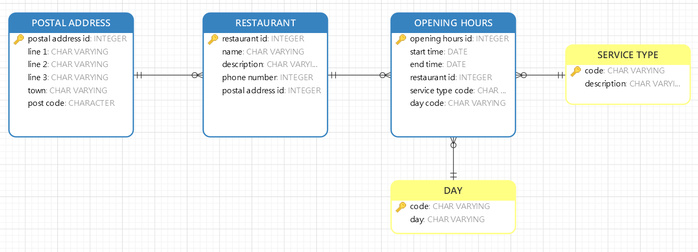

```{r setup, include=FALSE}
knitr::opts_chunk$set(echo = TRUE)
```


# Learning Objectives

* Continue with your Balti Curries ordering app model

# Requirement description refresher

The owners of the restaurant want to reduce the time it takes to take over the counter orders at busy times by providing customers with an in-store iPad app that allows them to create their order when they arrive. The app should :

1. Allow customers to browse the menu by different menu categories :
  + Main menu categories e.g.  Appetisers, Mains, Vegetarian Sides, Breads, Rice, Sundries
  + Owner Categories e.g Chefs Specials; Western Dishes; Traditional Dishes
  + Lifestyle Choice Categories, e.g. Vegan, Vegetarian

2. A menu item may be in more than one category and under each category the customer will see a list of menu items.

3. Each menu item has a number, a name, description, price and list of main ingredients

3. In addition a menu item may be classified by one or more allergen types eg. Nut, Gluten, Dairy

4. The app will enable customers to select items and create their order as they browse;

5. The app will allow customer to enter their name as a reference for the order and to enter their loyalty card number if they have one;

6. The app will be feeding into a central system.  By logging in the owners will be able to view all the orders that have been entered and review which have been completed, which are in progress and which are in the queue;

7.  The order data collected will also allow the owner to analyse numbers of orders on days and how long orders took to process.


The app only needs to allow customers to view/browse the menu, create an order, identify themselves and submit an order. The owners do not want the app to take payments at this time.


# MVP Task 

Create an LDM for the remaining requirements (5-7) in a new Order subject area:

* Entities
* Attributes
* Relationships (resolving many to many relationships where required)
* Primary and Foreign keys

Identify Classification or Category entities with a different colour coding.

# Extension task

If you did the Extension task on day 1 continue and complete with attributes, keys and foreign keys as for the MVP subject areas.

Consider if there are any modifications you would consider making in the PDM.

# Solutions

## MVP task

<details>
<summary>**Order Subject Area**</summary>


</details>
<br>

## Extension task
<details>
<summary>**Restaurant Info Subject Area**</summary>


</details>
<br>
<details>
<summary>**PDM Considerations**</summary>


1. MENU ITEM.price attribute could be pulled out into a reference table of PRICING TYPE.  If you have a finite list of prices and you associate one of these with your menu item then if you decide to apply a 10% increase to all prices all you need to do is change the reference values and the new prices will be automatically applied.

2. Create the OPENING HOURS entity as a reusable reference set allowing reuse of an opening hours option by multiple restaurants if the company expands.  This would require a new resolving table between RESTAURANT and OPENING HOURS with a move of the restaurant id foreign key.

3. Pull out phone details from the RESTAURANT entity into a separate table.  If your restaurant then decides to have additional phone numbers you just need to add a new one to the list.

</details>
