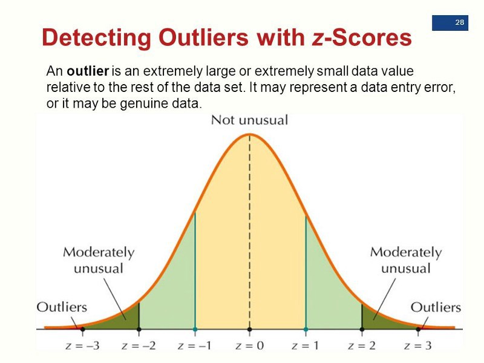
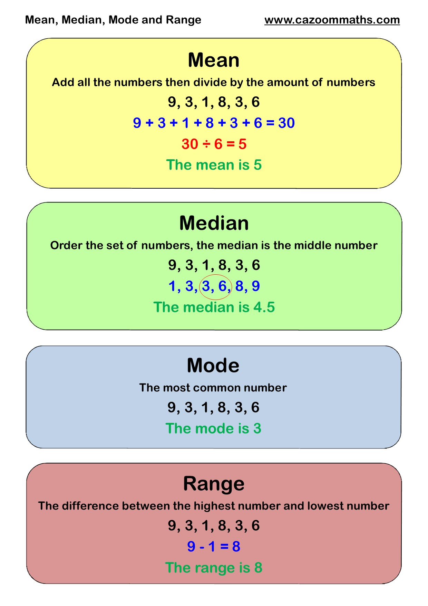

```{r setup, include=FALSE}
knitr::opts_chunk$set(echo = TRUE, fig.align = 'center')
library(tidyverse)
```


# Learning objectives

1. Understand the implications of outliers in a dataset
2. Be able to identify outliers in a dataset and decide relevant way forward
3. Understand the options available deal with outliers


# What is an outlier? 

An outlier is an observation (or set of observations) which appear to be inconsistent with that set of data. For example, any data that is either very high, very low, or just unusual (within the context of your project), is an outlier. They may be indications of data quality issues. As part of data cleansing, a data scientist/analyst would typically identify and then address the outliers. 

<br>

<div class='emphasis'>
A classic example to demonstrate how outliers can mess with your data is: 

The software billionaire, Bill Gates, walks into a bar which has 10 other people already in it. As soon as he walks in, the average wealth of everyone in the bar rises to about 91 million dollars. Obviously, this isn't actually the case. If I were to describe the patrons of this bar as having an average annual income of $91 million, the statement would be both statistically correct and grossly misleading.
</div>
<br>

What do outliers mean? It's hard to say. Some culprits:

1. An outlier may be due to variability in the measurement 
2. Maybe indicate experimental error - the data might have been collected wrongly or there is equipment error
3. Maybe the data itself is wrong : this happens a lot when you collect data from people. They miss out responses, or give wrong responses and it can affect the data. 
4. Might just be a genuine extreme data point - it happens!


But it's important to identify them and deal with them, as an outlier can cause serious problems in statistical analyses.


# How do we identify an outlier?

Often the easiest and quickest way to identify an outlier is to plot your data. Usually outliers are shown on boxplots (or sometimes histograms and scatterplots depending on what data you have). 

A boxplot is a standardized way of displaying the distribution of data based on a five number summary (“minimum”, first quartile (Q1), median, third quartile (Q3), and “maximum”). It can tell you about your outliers and what their values are. It can also tell you if your data is symmetrical, how tightly your data is grouped, and if and how your data is skewed.

<br>
<center>

</center>
<br>


Let's have a look now. We can use the built in dataset `iris` for this. Let's do a boxplot first:

```{r}
# create a boxplot of all variables (apart from species, it's categorical) in iris

iris_variables <- iris %>%
    select(-Species)

boxplot(iris_variables)
```

Boxplots show the outliers as circular values outside the quartile ranges. Let's look at our height data. Looks like we have outliers in the `Sepal.Width` variable. Let's plot this more

```{r}

# just make a single boxplot of sepal.width
boxplot(iris$Sepal.Width)

```

So, what does this tell us? In our boxplot we can see we have some outlier values: some flowers have really low and high sepal widths, compared to the others. 

Aside from just having a look visually, outliers can be defined mathematically. In mathematical sense, an outlier is usually defined as an observation more than three standard deviations from the mean (although sometimes you'll see 2.5 or 2 as well). It's not the only mathematical definition, but since it's the one that's used the most often that's what we'll use here as well.

<br>
<center>

</center>
<br>


Z-score: The number of standard deviations away from the mean that a particular observation is. (You can see the mathematical definition here, if you're curious.) A negative Z-score means an observation is below the mean, while a positive one means it above it. The further away from 0 the Z-Score is, the further away from the mean your observation is.


# What do we do once we've identified them? 

Deciding what qualifies as an outlier and what doesn't can be one of the hardest parts of the job. Most of the time, you will have a criteria to follow. For example, say you had a dataset which recorded temperatures in a certain city over time. If you had an abnormal reading of say, 150 degrees celsius, you would know that is an outlier value and could decide that perhaps the equipment was broken. Other times, there is less guidance.   

Generally accepted methods of dealing with outliers are: 

**Delete the outlier values or even the actual variable where the outliers exist** : This is probably the easiest option for dealing with outliers, but is also quite dangerous as it is only a valid options if the outliers aren't **real** data values.

**Transform the values or the variable itself** : in some cases, you may be justified in imputing the outlier values with some other value. For example, maybe someone accidently shifted a decimal place when entering the data. If you know this is the case, then you could reasonably replace this value with say - the median value of the data. The end result is the same: the outliers are artificial, as is the value you've replaced it with. 

**Split the outliers into their own dataset** : this can be a good approach when you're interested in WHY there are outliers. Are there patterns in the data? Is there something in it that can explain the presence of the values? For example, perhaps you have length data recorded for a variable. Maybe the outlier values are all those measured in cm, and the rest have been put in in inches by acccident? Splitting the data could help uncover this. 

Overall, there are many different ways of dealing with outliers, and it's up to you to make the right call on which to use (or which combination of methods to use). The important point is to record and justify your decision around which method you have chosen to use.


<blockquote class='task'>
**Task - 5 mins** 

What would the pitfalls of each approach mentioned above be?

<details>
<summary>**Answer**</summary>

* Deleting outliers: you could be deleting real data that might be there for a valid reason!

* Transforming data: It can be difficult to find out whether an outlier is there by genuine mistake, and again, you need to be careful that you're not replacing real data.  
* Splitting and investigating: this can be time consuming, and often you're not overly interested in what causes outliers so it's not worth the time spent investigating. Of course, there might only be a couple of outliers to deal with and so making a whole new dataset is a bit redundant. 

</details>
</blockquote>


# Dealing with outliers in a dataset: Brazil's House of Deputies Expenditures

To pratice identifying outliers we will use a dataset showing the expense accounts from members of Brazil's House of Deputies. The data is open source, and [free to download from the official government site](http://www2.camara.leg.br/transparencia/cota-para-exercicio-da-atividade-parlamentar/dados-abertos-cota-parlamentar). However, we will use [the version from kaggle](https://www.kaggle.com/epattaro/brazils-house-of-deputies-reimbursements/downloads/brazils-house-of-deputies-reimbursements.zip/4) which has been converted to csv files and the titles converted to English for us. 

This dataset is a good one because (a) it contains a lot of outliers, and (b) the outliers are actually data points you should be interested in. If a government official is getting a lot of reimbursements, it means they are spending a huge amount of public funds, and that's probably something we want to pay attention to.

The `refunds_info` dataset contains expenses data and amounts for deputies from 2009 to 2017, and info about who is claiming the expenses.


<blockquote class='task'>
**Task - 5 mins** 

Load in the `refunds_info.csv` file and take a look at it. Look at the dimensions and variable names and types.   

<details>
<summary>**Answer**</summary>
```{r, message=FALSE, warning=FALSE}

# load in the data 
refunds  <- read_csv("data/refunds_info_sample.csv")
dim(refunds)
names(refunds)
head(refunds)
```
</details>
</blockquote>


## Plotting refund outliers

One of the easiest ways to see if your dataset has outliers is to plot your data. The type of plot you pick will depend on how many and what kind of variable you're interesting in looking at. We've already looked at how to use a boxplot to find outliers, so we will do the same here. 
Let's first use a boxplot to see if we have any outliers in the refunds that politicians are getting. We can do this in two ways. We can use the base R `boxplot` function, as we did earlier:  
  

```{r}
# use a box plot to see if we have outliers in the refund_value column
boxplot(refunds$refund_value)
```
  
Or we can use the `ggplot` version:  

```{r}
# ggplot version of a boxplot 
ggplot(refunds, aes(x = "refunds", y = refund_value)) +
    geom_boxplot() + ylab('refund amount \n') + xlab("\n brazillian deputy refund claim")
```


Using `ggplot` to create visualisations is extremely useful, but goes beyond the scope of this intro to R course. We will teach you how to do a few basic plots here, and if you're interested further we run a 4 day Visualisations and Dashboard course, where we cover it more in depth. 


If we look at our graph above, we can see we have a lot of outlier values. That straight line is actually the boxplot : everything above that line are a bunch of points showing outliers that are overlapping with each other. What might be better to help us understand where these outliers are in the data is for us to break this up by a category. 

```{r}
# look for outliers for each different refund description
ggplot(refunds, aes(refund_description, refund_value)) +
    geom_boxplot() +  coord_flip() + 
  xlab("\n Refund Type") + ylab("\n Refund Value")
```

This tells us more! Mainly, that there appears to be a lot of outliers in the dissemination of parliamentary activity and mail categories, but not so many in fuel and phone costs.   

<blockquote class='task'>
**Task - 5 mins** 

Use the code above to make a boxplot which shows whether certain political parties have more refund outliers. 

<details>
<summary>**Answer**</summary>

```{r}
# look for outliers for each different refund description
ggplot(refunds, aes(political_party, refund_value)) +
    geom_boxplot() +  coord_flip() + 
  ylab("refund amount") + xlab("political party")
```

They all look pretty bad... more investigation needed!

</details>
</blockquote>

<br>

## Identifying where the refund outliers are in the data 

Alright, now we know some techniques for visualising our outliers, let's learn how to identify which rows in our data contain outliers. As you may remember from above, one way to identify outliers is to determine which points have a z-score that's far from 0. 

We can use the `scores()` function from [Lukasz Komsta' s outliers package](https://cran.r-project.org/web/packages/outliers/outliers.pdf) to quickly calculate the z-score for every value in a specific column in our table. 


```{r}
# load the outliers package
library(outliers)

# get the z-scores for each value in refund_value
refund_zscores <- scores(refunds$refund_value)

```

Now we just need to look and see which of those values are outside of our threshold. As we said before, mathematically an outlier is usually defined as an observation three standard deviations above or below the mean. So, let's try this. 


```{r}
# create a logical vector the same length as outlier_scores
# that is "TRUE" if outlier_scores is greater than 3 or
# less than negative 3
is_outlier <- refund_zscores > 3 | refund_zscores < -3

# add a column with info whether the refund_value is an outlier
refunds <- refunds %>%
  mutate(is_outlier = is_outlier)

```


Here, what we have done is create a new vector that's "TRUE" if a value is an outlier (i.e. if it has a zscore of 3 or -3 in our outliers vector) and "FALSE" if it's not. Then we add it into the `refunds` data as a new logical vector column called `is_outlier`. Now we can use that new `is_outlier` column to plot the outlier and non-outlier values separately, and to separate and clean up the data. 


```{r}
# look at the same plot as above, with outliers in a separate facet
ggplot(refunds, aes(refund_description, refund_value)) +
    geom_boxplot() +
    coord_flip() +
    facet_wrap(~is_outlier)
```
Looking a bit better! Now we can separate them out and plot just the outliers.
  
  
```{r}

# create a table with only outliers
refund_outliers <- refunds %>%
  filter(is_outlier == TRUE)

# base R version
# refunds_no_outliers <- refunds[refunds$is_outlier == T, ]

# take a peek
ggplot(refund_outliers, aes(refund_description, refund_value)) +
    geom_boxplot() +  coord_flip()
```

You can see the outliers are so numerous, that they actually almost form their own datasets. This is a sign that these outliers aren't random - there is a pattern and there is potentially a reason for it. In this case, it's probably dirty politicians, so it's interesting to separate them out.   


## Dealing with our refund outliers


Ok, now that we know which specific values are outliers... what do we do with them? There are a lot of different strategies for what to do with outliers, and which one you should use for your specific project depends on what your goals are, and why you think you have outliers. Let's look at them all. 


**Option 1 : Removing them***   
The easiest option for handling outliers is just to drop the rows that have outliers in them.


```{r}
# only get rows where the is_outlier column we made is equal to "FALSE"
refunds_no_outliers <- refunds %>%
  filter(is_outlier == FALSE)

# base R version
# refunds_no_outliers <- refunds[refunds$is_outlier == F, ]
```

<blockquote class='task'>
**Task - 5 mins** 

Create a boxplot to visualise your new, non-outlier data. Does it look better?  

<details>
<summary>**Answer**</summary>
```{r}
# create a plot to visualise your new, no outlier data
ggplot(refunds_no_outliers, aes(refund_description, refund_value)) +
    geom_boxplot() +
    coord_flip()
```

Looking better! Although now we've got rid of the main outliers in one, you can see that the other columns before, which looked alright, now seem to have a lot of outliers as well. Sigh... This is usually a long process. You do one category, then look at another. And do one variable, and then look at another. 

</details>
</blockquote>


**Option 2 : Consider outliers separately**  

This option is the most lengthy, and is the one we've already covered - setting the outliers into a separate table and plotting them separately. As we've already discussed, in this particular case, this is probably the best option, given that it is interesting and there is a clear non-random reason for the data.   


**Option 3: Replace the outliers with imputations**   

As discussed in the intro, this option is good when you know for sure you have data entry errors. It can also be good if there is a clear pattern of outliers - e.g. all NA's are -9999. So, what is imputation?

<center>Imputation: The fancy math term for guessing what the value of a missing cell in your dataset should actually be. </center>

So, for example, we can replace all the outliers with NA's. 

```{r}
# replace outliers with NA
outliers_na <- refunds %>%
  mutate(refund_value = na_if(is_outlier, "TRUE"))   

# # base R
# refunds[refund_zscores > 3| refund_zscores < -3, "refund_value"] <- NA

# check to make sure we actually did that
outliers_na %>% 
  select(refund_value, is_outlier) %>% 
  filter(is_outlier == TRUE) %>%
  distinct(refund_value)

```

Yep, our `refund_value` column now only contains NA's where `is_outlier == TRUE`, so we can see it worked. In some cases, it might be a good idea to replace the outlier values with a value such as the median. However, in this case, it's probably not a good idea to replace the outlier values with another value, as the outlier values themselves are of interest to us. 

We can also replace the values with a numerical value, taken from our data. 

<br>
<center>

</center>
<br>

You can view the mean and median of your variable by using the `summary()` function.   

```{r}
summary(refunds$refund_value)
```

R doesn't have a built in function for calculating the mode, but that's ok for now. We can impute with the mean and median value for now, as these tend to be the most widely used.   


Let's start by replacing all the missing values with the average (mean) value.   


```{r}

# replace outliers with median score (calculated above)
mean_outliers <- refunds %>% 
        mutate(refund_value = ifelse(is_outlier == TRUE, 
                                     mean(refund_value), 
                                     refund_value))

# check it's ok
mean_outliers %>% 
  filter(is_outlier == TRUE) %>% 
  select(refund_value, is_outlier) %>%
  distinct(refund_value)

```
We can see this worked, because it matches our mean value, and there is only one value in all cases where `is_outlier == TRUE`.   
<br>  


<blockquote class='task'>
**Task - 5 mins**

Instead of replacing all the outlier values with the mean, replace them with the median. Check it worked. 


<details>
<summary>**Answer**</summary>
```{r}

# replace outliers with median score (calculated above)
median_outliers <- refunds %>% 
        mutate(refund_value = ifelse(is_outlier == TRUE, 
                                     median(refund_value), 
                                     refund_value))

# check it's ok
median_outliers %>% 
  filter(is_outlier == TRUE) %>% 
  select(refund_value, is_outlier) %>%
  distinct(refund_value)

```
</details>
</blockquote>

Great. Now you've managed to work with some outliers from one column of the dataset. As you can see, outlier identification and removal is a long and laborious process, that - depending on the dataset you are working with - consumes a lot of your time. No matter what dataset you're working on, the principles will always be the same.   


