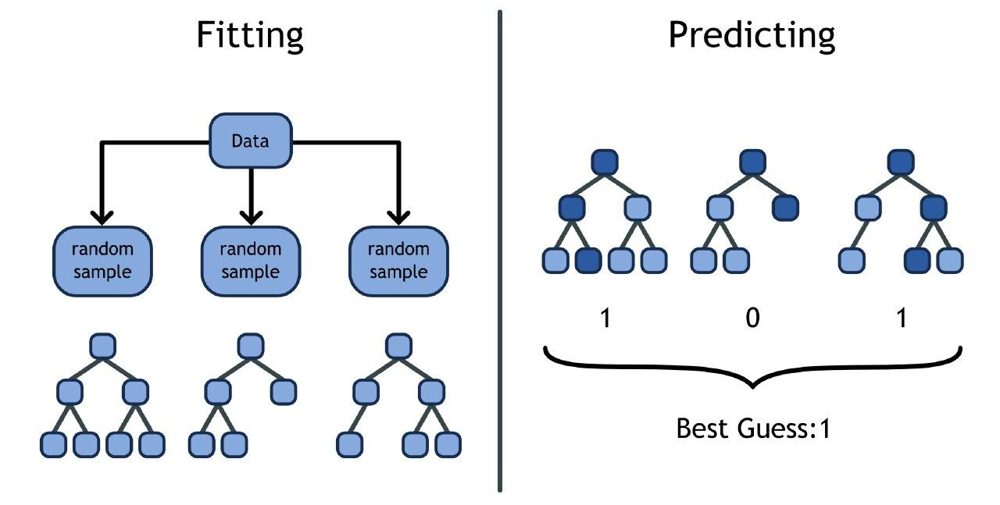

In this lesson you'll learn how to do some of the statistical modelling techniques that you've learnt so far in Python. Python and R take rather different approaches to statistical modelling. R was designed for statistics, and has built in support for t-tests, linear models etc. Python was not designed for statistics, and while it is possible to do all types of statistical tests in Python, it's not as straight forward. 

Python is generally designed for *machine learning*. This generally means models are focused on predictive accuracy, rather than interpretation. Python also has a focus on *machine learning pipelines*; this forces you to think more about how your data is going to be processed.

With modern R and modern Python there is very few techniques that you can't do in both languages. The differences lie in what is easy to do, rather than what is possible. 

# Learning Objectives

* Be able to use `scikit-learn` to build models in R.
* Understand some of the differences between model building in R and Python.
* Understand the how a random forest classifier works. 

**Lesson Duration: 2 hours**

```{r, echo = FALSE}
library(reticulate)
use_python("/usr/local/anaconda3/bin/python", required = TRUE)
```

# Linear Regression

## Exploring the data

To start we are going to see an example of building a linear model. The dataset we are going to use is "conspiracy_belief_score.csv". This dataset comes from the Open Psychometrics project. It has information on the conspiracy belief score for people who took an online test. We also have information on people backgrounds, including their age, gender and where they live. Before we start building models we need to make sure we understand the data. 

First we read the data in:

```{python}
import pandas as pd

conspiracy_belief = pd.read_csv("data/conspiracy_belief_score.csv")
```

Then use `head()` to look at the first few rows.

```{python}
conspiracy_belief.head()
```

And `describe()` to get some summary statistics.

```{python}
conspiracy_belief.describe()
```

There is lots you could do to explore this data using `pandas` and `seaborn`, but we're going to cheat by using a Python package!

Install pandas profiling using the following command in the terminal.

```
conda install -c conda-forge pandas-profiling
```

This package has a function `ProfileReport` which has lots of plots and summaries that are particularly useful for doing modelling. Run this now.


```{python}
import pandas_profiling

pandas_profiling.ProfileReport(conspiracy_belief)
```

<blockquote class = 'task'>
**Task - 5 minutes**

Have a look at the report. 

Do you see anything that needs to be cleaned?

How well do you think the model will work?

</blockquote>


## Cleaning data

After you have explored the data you'll need to clean the data. As you  know from making models in R, there are lots of things you might need to do to clean the data. 

We have given you a nice clean dataset here so the only thing we need to do is create dummies. 

### Creating dummies 

Unlike R, when you are working in Python you need to create dummies yourself. Luckily, there is a function from pandas that makes this easy.

```{python}
conspiracy_belief = pd.get_dummies(conspiracy_belief, drop_first = True)

conspiracy_belief.head()
```

We set `drop_first = True` because for a variable with four levels, you only need three dummy variables.

## Building the model

Now finally we can build our model! 

To build all the models today we are going to use a package called `scikit-learn`. This package has a huge range of different models. Unlike R, we don't have any models built in to the language. Also, in R you generally have to download a new package for each new model you want to run. This is different in Python and almost every model you could never need is inside `scikit-learn`.

You do not need to install anything, as `scikit-learn` comes as part of Anaconda.

Since `scikit-learn` is so large, we normally import the models one at a time.

```{python}
from sklearn.linear_model import LinearRegression
```

The syntax for describing a model is different in Python compared to R. We need to make a data frame with all the variables we are using for predicting, and we need the variable we want to predict in it's own array. There is a library called `patsy` available (see additional resources). 

```{python}
y = conspiracy_belief["conspiracy_belief_score"]
X = conspiracy_belief.drop(columns = "conspiracy_belief_score")
```

Then we define the model we want to use and fit it using the data we extracted.

```{python}
model = LinearRegression()

model.fit(X, y)
```

Unlike R, we don't have a handy summary of the model. But we can pull out the R-squared value by using the `score` method.

```{python}
model.score(X, y)
```

To get the coefficients, we need to do it in two parts. We get the coefficient for the intercept by looking at the `intercept_` attribute.

```{python}
model.intercept_
```

And we get the rest of the coefficients using the `coef_` attribute. These coefficients are returned in the same order as  the variables appear in the data.


```{python}
model.coef_
```

<blockquote class='task'>
**Task - 5 mins**

1. Interpret the R-squared value
2. Interpret some of the coefficients.

<details>
<summary>**Solution**</summary>

1. These are very low R-squared values. We're not doing a very good job at predicting conspiracy belief score!

2.

```{python, echo = FALSE}
pd.DataFrame(
  {
  "Variable" : X.columns.values,
  "Coefficient" : model.coef_
  }
)
```

For every extra member of your family your conspiracy belief score increases by 0.037 etc.

These are hard to interpret because we don't have the associated p-values.

</details>
</blockquote>


# Logistic Regression

Now let's see an example of logistic regression. The file `loans.csv` has real data from an online platform called Lending Club. Each row represents a loan given out on Lending Club. We have information on what the loan is for, the interest rate charged etc. We want to predict if a loan will be paid back.

## Exploring the data

Let's start by reading in the data and having a look at using `pandas-profiling`.

```{python}
loans = pd.read_csv("data/loans.csv")

pandas_profiling.ProfileReport(loans)
```

## Cleaning the data

There's a few things we need to do to clean this data. First, we are only interested in historical loan data. So let's filter the data.

```{python}
loans = loans[loans["loan_status"] != "Current"]

loans.head()
```


There's quite a few missing values here. The right thing to do would be to investigate why the values were missing and decide what action to take. Back when you learnt about the tidyverse we discussed all the ways of dealing with missing values. For this lesson, let's be lazy and just delete all missing values.

```{python}
loans = loans.dropna()
```

The `shape` attribute confirms that we have dropped data from here.

```{python}
loans.shape
```

We want to predict if a loan has been paid off, but we have several values for `loan_status`. We need to make a new column that just checks if loan status is equal to "Fully Paid", and then we need to convert this column into a numeric column (since `scikit-learn` always needs numeric data).

```{python}
loans["paid"] = loans["loan_status"] == "Fully Paid"
loans["paid"] = loans["paid"].astype(int)

loans = loans.drop(columns = "loan_status")

loans.head()
```

Again, since we need numeric data then we need dummy variables.

```{python}
loans = pd.get_dummies(loans, drop_first = True)

loans.head()
```

Now finally we can split our data into predictors and the target variable.

```{python}
X = loans.drop(columns = "paid")
y = loans["paid"]
```


For this example, since we are more interested in making predictions than interpreting the model, let's split the data into a test and training set. We can do this using the function `train_test_split` from `scikit-learn`. 

```{python}
from sklearn.model_selection import train_test_split
```

Here we have set the `test_size` to 0.1, to take 10% of the data as a test set. Specifying `random_state` is like using `set.seed` in R. This makes the random splitting of the data reproducible.

```{python}
X_train, X_test, y_train, y_test = train_test_split(X, y, test_size = 0.1, random_state = 7)
```

The code above uses Python "syntactic sugar". Since `train_test_split` returns a tuple, we can define several variables at once.

## Building the model

Now that we have the test and training set we can run our model. This time we are using logistic regression, so we need to import `LogisticRegression`, define our model object, then fit to the training data.

```{python}
from sklearn.linear_model import LogisticRegression

model = LogisticRegression()

model.fit(X_train, y_train)
```

Now we can see the r-squared value on the training data.

```{python}
model.score(X_train, y_train)
```

And on the test data.

```{python}
model.score(X_test, y_test)
```

<blockquote class = 'task'>
**Task - 5 minutes**

Interpret the R-squared values you found. 

</blockquote>

# Decision Trees

Now we are going to see an example of using a different model on the same data.

You should be beginning to see a pattern in how to use a model from `scikit-learn`: first we import the model, then we define a model object and finally we fit the model to the data.

To stop the tree getting too complicated we are going to change some parameters on the model object. We are going to set `max_features` to 3, this means we will use at most three variables. We will also limit the depth of the tree.

```{python}
from sklearn import tree

model = tree.DecisionTreeClassifier(max_features = 3, max_depth = 5)

model.fit(X_train, y_train)
```

Again, we can get the R-squared value for this model by using the `score` method.

```{python}
model.score(X_test, y_test)
```

Make sure that you fit using the training data and calculate the R-squared value on the test data.

<blockquote class = 'task'>
**Task - 5 minutes**

Interpret the R-squared value. Which is does a better job of predicting, the decision tree or logistic regression?

</blockquote>

# Random Forest

In the last part of this lesson we are going to cover a model that you have not seen before. 

Random forest is a powerful, general classifier algorithm. It is called random forest because it uses a collection of decision trees!

First we set the number of trees you want to build. Then you take a random sub sample of the data and build a decision tree on it. You repeat this process for every tree. Each tree should be built on it's own sub sample of the data. Now we have a big collection of decision trees. 

If we want to make a prediction, first we make a prediction using every tree in the set, then we take the average answer. For example, if we have 10 trees and 3 of them guess that a loan will not be repaid and 7 guess that it will, then our answer will be a 70% chance that the loan is repaid. 



This has a big advantage over decision trees because decision trees can be very sensitive to small changes in data. A slightly different dataset will give a totally different tree structure. We can "average" over the possible tree structures for the data by using a random forest.

This type of model building, where we average across several models, is often called "ensemble learning".

Let's see an example in Python. Again, we import he model, define the model object and finally fit to our data.

```{python}
from sklearn.ensemble import RandomForestClassifier

model = RandomForestClassifier(n_estimators = 10)

model.fit(X_train, y_train)
```

Here we set `n_estimators` to be 10, because we are using 10 decision trees.

<blockquote class = 'task'>
**Task - 5 minutes**

Find the R-squared value on the test data and compare it to our two other models.

<details>
<summary>**Solution**</summary>

```{python}
model.score(X_test, y_test)
```

There is randomness here, so your model will have slightly different results!

</summary>
</blockquote>


# Additional Resources

The `patsy` library will let you use formula notation in Python: https://patsy.readthedocs.io/en/latest/